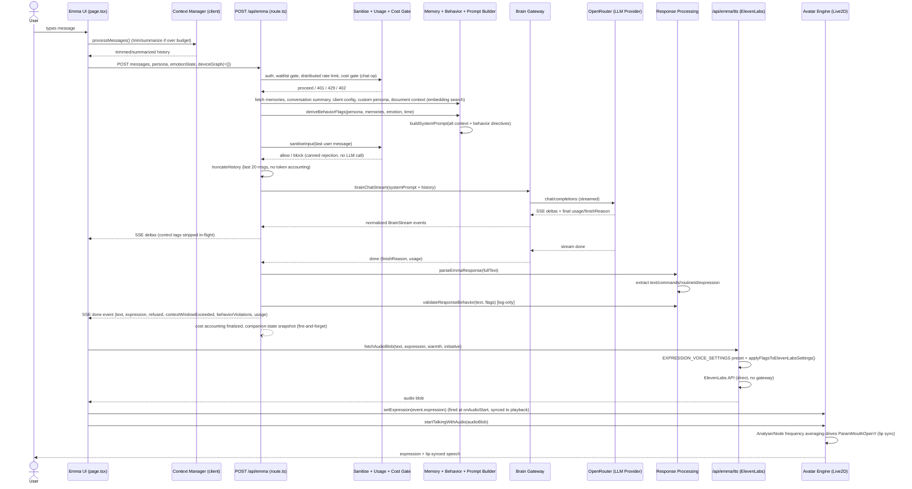

# Emma Brain Gateway — Phase 0: Required Input Review Report

## Document Status

- Roadmap: [Brain Gateway Roadmap v1.0 (Frozen)](roadmaps/brain-gateway-roadmap-v1.md)
- Phase: Phase 0 — Required Input Review
- Type: Review-only. No architecture redesign, no ADRs, no implementation, no runtime-behavior changes were made in producing this report.
- Branch: `feature/brain-gateway-phase0-required-input-review`

This single document contains all six Phase 0 deliverables as sections:

1. Required Input Review Report (this document, §1)
2. Existing AI Architecture Diagram (§2)
3. Current AI Request Flow Diagram (§3)
4. Dependency Map (§4)
5. Documentation Inventory (§5)
6. Initial Findings (§6)

---

## 1. Required Input Review Report

### 1.1 Executive Summary

Emma's inference boundary is not greenfield. A Brain Gateway already exists and is load-bearing in production: `src/core/brain/gateway.ts` is the sole entry point for `brainChat` / `brainChatStream` / `brainEmbed`, backed by a single OpenRouter provider implementation (`src/core/brain/providers/openrouter.ts`), consumed by 15 call sites across API routes and core modules, none of which touch provider wire details directly. This was designed under ADR-0003 and implemented under Phase 7B (2026-07-14), documented in `docs/phase7a-brain-architecture-readiness.md` and `docs/phase7b-brain-gateway-implementation-report.md`.

Around that gateway sits a substantially larger system: a deterministic behavior-flags layer (ADR-0001) that derives tone/verbosity/teasing/warmth/initiative from persona, memory, emotion, and time, and fans out into the prompt builder, response validator, greeting engine, proactive speech, avatar engine, and voice modulation; a memory pipeline with keyword-heuristic (not embedding-based) retrieval and AES-256-GCM field encryption; a client-side emotion-fusion engine blending voice/vision/text signals; two independent, un-reconciled context-summarization pipelines (client-side ratio-based, server-side message-count-based); and two fully separate "provider" integrations for TTS (ElevenLabs, direct HTTP, no gateway abstraction) and STT (OpenAI Whisper, direct HTTP, no gateway abstraction) that sit outside ADR-0003's stated scope.

The review found the existing gateway boundary itself to be clean (confirmed: zero UI-layer or provider-leaking imports outside `src/core/brain/`), but found several areas where duplicated logic, un-reconciled parallel mechanisms, or stale documentation exist adjacent to it. These are documented as observations in §1.7 and §6, without recommendations, per Phase 0's review-only mandate.

### 1.2 Reviewed Components

| Component                          | Primary file(s)                                                                                                                  |
| ---------------------------------- | -------------------------------------------------------------------------------------------------------------------------------- |
| AI request flow (entry → response) | `src/app/app/page.tsx`, `src/lib/stream-client.ts`, `src/app/api/emma/route.ts`                                                  |
| LLM provider integration           | `src/core/brain/gateway.ts`, `src/core/brain/types.ts`, `src/core/brain/providers/openrouter.ts`, `src/core/models.ts`           |
| Prompt construction                | `src/core/personas.ts`                                                                                                           |
| Context management                 | `src/core/context-manager.ts`, `src/app/api/emma/summarize/route.ts`, `src/app/api/emma/history/route.ts`                        |
| Memory integration                 | `src/core/memory-db.ts`, `src/core/memory-shared.ts`, `src/core/memory-extraction-parser.ts`, `src/app/api/emma/memory/route.ts` |
| Behavior pipeline                  | `src/core/behavior-flags.ts`                                                                                                     |
| Emotion pipeline                   | `src/core/emotion-engine.ts`, `src/app/api/emma/emotion/route.ts`                                                                |
| Response processing                | `src/core/response-validator.ts`, `src/core/command-parser.ts`                                                                   |
| TTS integration                    | `src/app/api/emma/tts/route.ts`, `src/core/voice-behavior.ts`, `src/core/voice-engine.ts`                                        |
| Avatar integration                 | `src/core/avatar-engine.ts`                                                                                                      |
| Configuration                      | `src/core/models.ts`, `src/core/client-config.ts`, `src/core/env-validation.ts`, `docs/reference-env-vars.md`                    |
| Existing documentation             | `docs/adr/*`, `docs/explanation-architecture.md`, `docs/phase7a-*`, `docs/phase7b-*`, `docs/phase7r-*`, `docs/roadmaps/*`        |

### 1.3 Existing AI Architecture

**Brain Gateway (`src/core/brain/`).** `gateway.ts` holds a single module-level `BrainProvider` instance (`createOpenRouterProvider()`), exposing `brainChat`, `brainChatStream`, `brainEmbed`, `isBrainConfigured`. No routing/selection logic exists — one provider, no fallback provider, consistent with ADR-0003's stated out-of-scope items. `types.ts` defines an OpenAI-compatible `BrainMessage` shape (chosen because it's already persisted in `tasks.step_transcript`), a closed `BrainTask = "brain" | "vision" | "utility"` union (capability-tier selection, not per-provider model lists), a normalized `BrainFinishReason`, and a closed `BrainRequestError.code` enum. `providers/openrouter.ts` is, by its own header comment, "the single place in the codebase permitted to know what OpenRouter looks like on the wire" — it owns the URL, headers, SSE parsing, 529→`OVERLOADED` normalization, and the OpenRouter-specific `models:[...]` fallback-array + `response_format.json_schema` request shape.

**Model registry (`src/core/models.ts`).** Static config, zero `process.env` reads: `MODEL_BRAIN = "openai/gpt-oss-120b:free"` (comment: "DEV: free tier. LAUNCH: anthropic/claude-sonnet-4-5"), `MODEL_VISION = "google/gemini-2.5-flash"`, `MODEL_UTILITY` same free-tier model as brain (comment notes the 20b variant was excluded for lacking `tool_calls` support). The embedding model id (`openai/text-embedding-3-small`) is instead hardcoded in `providers/openrouter.ts`, with an in-file comment framing this as "provider configuration, not caller configuration."

**Behavior-flags layer (`src/core/behavior-flags.ts`, ADR-0001).** A pure, deterministic function `deriveBehaviorFlags(inputs) → BehaviorFlags` (`verbosity`, `emojiUsage`, `teasingLevel`, `warmth`, `initiative`). Precedence: persona baseline → customPersona.verbosity override → memory preferences (confidence ≥ 0.6, most-recent-wins) → emotion modulation (can only soften, never exceed a pre-emotion "teasing ceiling") → time-of-day modulation (late night can only reduce initiative). `renderBehaviorDirectives()` diffs flags against baseline and emits only non-default directives into the prompt.

**Prompt builder (`src/core/personas.ts`).** `buildSystemPromptBlocks()` assembles a "stable" block (persona + response-length rules + routine/tool catalogue + memories + user profile + optional custom persona) and a "dynamic" block (time context, document/vision context wrapped in `[EXTERNAL DATA]` guards, emotion state, behavior directives). `buildSystemPrompt()` is a "backward-compat wrapper" that flattens both into one string — the only function actually called by the API route.

**Memory pipeline (`src/core/memory-db.ts`).** `getRelevantMemoriesForUser()` fetches all active memories then, only if the count exceeds the limit, scores by keyword-overlap × confidence (not embedding similarity). Persistence uses AES-256-GCM field encryption (`src/core/security/encryption.ts`), a 200-active-memory-per-user cap with soft-deletion of the oldest/lowest-confidence entry, and supersede-on-change semantics rather than in-place update.

**Emotion engine (`src/core/emotion-engine.ts`).** A client-only React hook fusing three signals — voice (RMS/ZCR/spectral-centroid heuristics), vision (server-side `brainChat` vision-tier call with a strict JSON schema), text (keyword table) — via confidence × fixed source-weight averaging, re-derived into a label via a circumplex (valence/arousal) mapping.

**Response processing (`src/core/response-validator.ts`, `src/core/command-parser.ts`).** `parseEmmaResponse()` strips `[EMMA_CMD]`, `[EMMA_ROUTINE]`, `[emotion:]` control tags from the raw model output. `validateResponseBehavior()` is explicitly, structurally log-only (per its own docstring) — it checks 3 of the 5 behavior flags (`emojiUsage`, `verbosity`, `teasingLevel`; `warmth`/`initiative` are unchecked) and never rewrites the response.

**TTS (`src/app/api/emma/tts/route.ts`) and Avatar (`src/core/avatar-engine.ts`).** TTS calls ElevenLabs directly (hardcoded base URL and model id in the route file), resolving the API key per-client from encrypted Supabase storage, not an env var. `voice-behavior.ts` applies a second, light behavior-flag-driven modulation pass (warmth → slower/softer; lowered initiative → calmer pace only) on top of an expression-keyed preset table. The avatar is a client-side Live2D (`pixi-live2d-display`) controller with idle-variant scheduling, tap-reaction handling gated by `teasingLevel`, idle cadence scaled by `initiative`, and real audio-driven lip sync (`AnalyserNode` frequency averaging) synchronized to `[emotion: x]` expression changes at actual audio-playback start, not at response-parse time.

### 1.4 Existing AI Pipeline

The end-to-end request lifecycle, in call order, per `src/app/api/emma/route.ts`:

1. Production environment validation (fail-closed 503 on misconfiguration)
2. Auth resolution + waitlist gate
3. Distributed per-user rate limit (`checkDistributedRateLimit`, namespace `req:brain`, 20/60s)
4. Request body parsed — **no runtime schema validation** on the chat body itself
5. Cost gate (`enforceCostGate`, operation `chat`) — a **second**, independently-configured rate limit on the same request, using the same underlying limiter with a different namespace/limit (`chat`, 10/10s)
6. Fail-open reads: relevant memories, latest conversation summary, per-client config, custom persona, document-context (embedding-based semantic search against `document_chunks`)
7. Time/locale context construction
8. `deriveBehaviorFlags()` → `buildSystemPrompt()` (behavior decided before prompt generation, per ADR-0001)
9. Input sanitisation (`sanitiseInput()`) on the last user message only; blocks on any high-severity injection signal, short-circuits with a canned persona-flavored rejection (never reaches the model)
10. History truncation (hard cap, last 20 messages — no token accounting) + Anthropic-content-block→OpenAI-content-part translation
11. `brainChatStream()` — the sole LLM call, `maxRetries: 2`, `timeoutMs: 30_000`
12. On provider failure: cost accounting, Sentry log, persona-flavored error message, 502
13. SSE streaming loop: control tags stripped from in-flight deltas so raw tags never reach the client mid-stream
14. On stream completion: `parseEmmaResponse()` → `validateResponseBehavior()` (log-only) → final `done` SSE event assembly (`text`, `raw`, `commands`, `routineId`, `expression`, `refused`, `contextWindowExceeded`, `behaviorViolations`, `usage`, `enforcement`)
15. Cost accounting finalized; usage-warning marking; fire-and-forget companion-state snapshot
16. Client (`src/app/app/page.tsx`) consumes the `done` event: rolls back on `refused`, hard-truncates history on `contextWindowExceeded`, sets `avatar.setExpression()` inside the TTS `onAudioStart` callback (sync point), triggers `voice.fetchAudioBlob()` → `/api/emma/tts` → ElevenLabs.

Two parallel context-summarization pipelines exist and are not reconciled with each other: a client-side, ratio-triggered one (`context-manager.ts` → `/api/emma/summarize`, result kept only in the client's in-memory message array as a synthetic `"[SUMMARY]"` turn, never persisted) and a server-side, message-count-triggered one (`/api/emma/history`, persisted encrypted to `conversations.summary`, loaded into the prompt as "Previous Session Context"). A single request can carry both a persisted "Previous Session Context" prompt block and an in-band synthetic `[SUMMARY]` message simultaneously.

The WhatsApp ingest channel (`src/app/api/emma/ingest/whatsapp/route.ts`) and the vision/summarize/history routes each maintain their own independent, hardcoded system prompt, entirely separate from `personas.ts` — WhatsApp-channel Emma has no persona, no long-term memory, no emotion state, and no behavior flags.

### 1.5 Existing Dependencies

See §4 (Dependency Map) for the full table. Summary: the UI layer never imports the Brain Gateway or provider code directly — it reaches inference only via `fetch()` to `/api/emma*` routes. All 15 Brain Gateway call sites import from `@/core/brain/gateway`, never from `providers/openrouter.ts` or `types.ts` directly. `src/core/behavior-flags.ts` is the single fan-out point that legitimately crosses from the "AI pipeline" side into the TTS/Avatar side (as `BehaviorFlags` values, not as imports of AI-pipeline modules by TTS/Avatar code). TTS and STT sit in a fully separate dependency subtree with no shared abstraction with the Brain Gateway.

### 1.6 Existing Documentation Inventory

See §5 for the full table.

### 1.7 Existing Technical Debt

Documented as observations only; no remediation is proposed here (that belongs to later roadmap phases).

- **Two independent rate-limit checks stack on the same chat request** (`route.ts:126-131` distributed limiter, `cost-gate.ts:162-163` calling the same underlying limiter under a different namespace/limit) — same implementation, different configuration, applied twice in sequence.
- **Two independent, schema-divergent usage-limit implementations exist**: `src/core/usage-enforcer.ts` (5-hour rolling window, `usage_windows` table) and `src/core/client-config.ts`'s `checkUsageLimits()` (daily/monthly, `usage` table with a `date` column).
- **Two independent context-management layers with no shared config**: client (`context-manager.ts`, 100k-token budget model, ratio-triggered) vs. server (`route.ts`, flat 20-message cap, no token accounting at all).
- **Two independent, un-reconciled summarization pipelines**, different prompts, different persistence (see §1.4).
- **Five independent hardcoded system prompts exist outside `personas.ts`**: vision (`vision/route.ts`), summarize (`summarize/route.ts`), WhatsApp (`ingest/whatsapp/route.ts`), and two in `history/route.ts` (summary + title) — none share text or a common template with each other or with `personas.ts`.
- **The `[EXTERNAL DATA]` prompt-injection guard is implemented independently three times** (documents and vision in `personas.ts`, search results in `route.ts`) rather than through one shared helper.
- **`serializeUserContext()` is implemented twice** with identical logic (`personas.ts:25-32` and `multi-user-engine.ts:131-138`), the latter apparently unused by the former.
- **Memory retrieval is keyword-heuristic, not embedding-based**, while document-chunk retrieval in the same request (`route.ts:256-288`) uses genuine embedding similarity search — two "recall relevant context" features in one request with inconsistent retrieval sophistication, and memories have no embedding column in the schema.
- **Behavior-flag derivation is duplicated in three places** (server `route.ts`, client `page.tsx`, and `agent-loop.ts`'s task-notification path) with different input completeness — the agent-loop path hardcodes `personaId: "mommy"` regardless of the user's actual persona.
- **Response validation covers 3 of 5 behavior flags**; `warmth` and `initiative` are rendered as prompt directives and consumed downstream but have no closed-loop verification.
- **`emotionState` in the chat request body is entirely client-asserted** and not independently re-verified server-side before it drives behavior derivation, prompt injection, and persisted mood history.
- **TTS and STT have no Brain-Gateway-equivalent abstraction.** ElevenLabs's base URL, model id, and request shape are hardcoded in `tts/route.ts`; the OpenAI Whisper STT call in `stt/route.ts` is a direct, non-gateway HTTP call with its own env-var key read. Both are documented in `phase7b-brain-gateway-implementation-report.md` as explicitly out of ADR-0003's scope.
- **TTS and LLM provider auth use two different secret-management patterns**: a single required env var (`OPENROUTER_API_KEY`) vs. per-client encrypted Supabase-stored tokens (ElevenLabs), with no shared abstraction.
- **`ADR-0003-brain-gateway-architecture.md:6`** still reads `"Implementation: None yet. This ADR is the architectural contract for Phase 7B; it does not itself change any code"` even though `phase7b-brain-gateway-implementation-report.md` (same date, 2026-07-14) documents that implementation as complete, and the code confirms it (verified directly: `src/lib/openrouter.ts` no longer exists; `src/lib/embeddings.ts` now calls `brainEmbed()` through the gateway). ADR-0001 and ADR-0002, by contrast, carry accurate "Implementation:" pointers.
- **Marketing copy (`src/lib/constants/landing.ts:180`)** states "Emma uses Claude models via OpenRouter," which does not match the model actually wired in `src/core/models.ts` (`openai/gpt-oss-120b:free`, explicitly commented as a dev placeholder for the intended Claude launch model).
- **`env-validation.ts` requires `OPENROUTER_API_KEY` unconditionally**, a single-provider assumption baked into env validation despite the gateway's nominal provider-agnostic contract — noted as accepted, deferred debt in `phase7b-brain-gateway-implementation-report.md`.
- **Client-asserted, server-unused fields**: `src/lib/stream-client.ts`'s `StreamDoneEvent` type declares `citations`, `generatedFiles`, `compactionBlocks`, `messageId`, and comments describing Claude `stop_reason` semantics — none of these fields are ever populated by the current OpenRouter-backed `route.ts`, and the `page.tsx` code branch reading `event.compactionBlocks` is consequently unreachable given the present server implementation.
- **A client-side kill-switch check for HTTP 501 exists** (`voice-engine.ts:545-548`) that no code in `tts/route.ts` currently triggers.

### 1.8 Initial Findings

See §6 (kept as a separate deliverable section per the phase spec; content is observational only, not recommendations).

---

## 2. Existing AI Architecture Diagram

Illustrates the system as currently implemented — not a proposed redesign.

```mermaid
graph TB
    subgraph Client["Client (Browser)"]
        UI["Emma UI\nsrc/app/app/page.tsx"]
        CTXMGR["Context Manager\n(client-side)\ncontext-manager.ts"]
        EMOTION["Emotion Engine\n(client-side, voice/vision/text fusion)\nemotion-engine.ts"]
        AVATAR["Avatar Engine\n(Live2D)\navatar-engine.ts"]
        VOICE["Voice Engine\nvoice-engine.ts"]
        STREAMCLIENT["stream-client.ts"]
    end

    subgraph API["API Routes (src/app/api/emma/)"]
        ROUTE["route.ts\n(main chat SSE)"]
        MEMROUTE["memory/route.ts"]
        VISROUTE["vision/route.ts"]
        EMOROUTE["emotion/route.ts"]
        SUMROUTE["summarize/route.ts"]
        HISTROUTE["history/route.ts"]
        TTSROUTE["tts/route.ts"]
        STTROUTE["stt/route.ts"]
        WAROUTE["ingest/whatsapp/route.ts"]
    end

    subgraph Pipeline["AI Pipeline (src/core/)"]
        SANITISE["security/sanitise.ts"]
        USAGE["usage-enforcer.ts"]
        COSTGATE["cost-gate.ts"]
        MEMDB["memory-db.ts"]
        BEHAVIOR["behavior-flags.ts\n(ADR-0001)"]
        PERSONAS["personas.ts\n(prompt builder)"]
        VALIDATOR["response-validator.ts\n(log-only)"]
        PARSER["command-parser.ts"]
        VOICEBEH["voice-behavior.ts"]
    end

    subgraph Gateway["Brain Gateway (src/core/brain/)"]
        GW["gateway.ts\n(brainChat/brainChatStream/brainEmbed)"]
        TYPES["types.ts\n(provider-agnostic contracts)"]
        MODELS["models.ts\n(model ID registry)"]
        PROVIDER["providers/openrouter.ts\n(sole OpenRouter wire knowledge)"]
    end

    subgraph External["External Providers"]
        OPENROUTER[["OpenRouter\n(chat/vision/utility/embeddings)"]]
        ELEVENLABS[["ElevenLabs\n(TTS, direct call)"]]
        OPENAI[["OpenAI Whisper\n(STT, direct call)"]]
    end

    subgraph Storage["Storage"]
        SUPABASE[("Supabase\nmemories/conversations/messages/\nusage_windows/client_integrations")]
        ENCRYPT["security/encryption.ts\n(AES-256-GCM)"]
    end

    UI --> STREAMCLIENT --> ROUTE
    UI --> CTXMGR --> SUMROUTE
    UI --> EMOTION --> EMOROUTE
    UI --> AVATAR
    UI --> VOICE --> TTSROUTE

    ROUTE --> SANITISE
    ROUTE --> USAGE
    ROUTE --> COSTGATE
    ROUTE --> MEMDB
    ROUTE --> BEHAVIOR --> PERSONAS
    ROUTE --> GW
    ROUTE --> VALIDATOR
    ROUTE --> PARSER

    MEMDB --> ENCRYPT --> SUPABASE
    HISTROUTE --> ENCRYPT
    USAGE --> SUPABASE
    COSTGATE --> SUPABASE

    GW --> TYPES
    GW --> PROVIDER
    PROVIDER --> MODELS
    PROVIDER --> OPENROUTER

    MEMROUTE --> GW
    VISROUTE --> GW
    EMOROUTE --> GW
    SUMROUTE --> GW
    HISTROUTE --> GW
    WAROUTE --> GW

    TTSROUTE --> VOICEBEH
    TTSROUTE --> ELEVENLABS
    TTSROUTE --> SUPABASE
    STTROUTE --> OPENAI

    VOICEBEH -.->|BehaviorFlags| BEHAVIOR
    AVATAR -.->|BehaviorFlags| BEHAVIOR

    classDef gateway fill:#2d5a3d,stroke:#1a3a26,color:#fff
    classDef external fill:#7a3b2e,stroke:#5c2a20,color:#fff
    classDef nogate fill:#6b4a1f,stroke:#4a3315,color:#fff
    class GW,TYPES,MODELS,PROVIDER gateway
    class OPENROUTER,ELEVENLABS,OPENAI external
    class TTSROUTE,STTROUTE nogate
```

Notes on this diagram (facts, not proposals):

- Everything in the **Gateway** subgraph (green) is the only part of the codebase permitted to know provider wire details, and this was confirmed by grep — no leaks found outside it (the one comment-only reference in `memory-extraction-parser.ts` and label-only reference in `admin-diagnostics.ts` do not construct provider requests).
- **TTS and STT routes** (amber) call external providers directly, with no gateway-equivalent abstraction — shown as direct edges to `ElevenLabs`/`OpenAI Whisper`, bypassing the `Gateway` subgraph entirely. This is documented as an intentional, explicit scope exclusion in `phase7b-brain-gateway-implementation-report.md:93`, not an oversight.
- The dotted lines from `VOICEBEH`/`AVATAR` to `BEHAVIOR` represent the one legitimate data crossing between the "AI pipeline" side and the "TTS/Avatar" side: `BehaviorFlags` values, not module imports of AI-pipeline code.

---

## 3. Current AI Request Flow Diagram

Illustrates the actual implemented request lifecycle for a standard web-app chat turn, per the exact flow requested in the Phase 0 scope (User → Emma UI → API → Current AI Pipeline → LLM → Response → TTS → Avatar → User).

Notes on this diagram (facts, not proposals):

- `deviceGraph` is always `{}` per `CLAUDE.md`/code — DeviceGraph is an inert stub kept for type compatibility; no physical device control occurs despite `[EMMA_CMD]` blocks still being parsed.
- The sanitisation block can short-circuit the entire flow before the LLM is ever called (high-severity injection match → canned in-persona rejection, no `brainChatStream` call).
- Two independent rate/cost checks occur in the `SEC` step (distributed limiter directly, then again inside the cost gate under a different namespace) — shown as one step here for diagram clarity, documented separately in §1.7.
- TTS and Avatar occur strictly after the SSE `done` event — they are not part of the streaming response itself, and are both client-orchestrated (the server has no role in triggering TTS or avatar state).

---

## 4. Dependency Map

| From                          | To                                                                                                                                                                                                                | Nature of dependency                                                                                                                                                          |
| ----------------------------- | ----------------------------------------------------------------------------------------------------------------------------------------------------------------------------------------------------------------- | ----------------------------------------------------------------------------------------------------------------------------------------------------------------------------- |
| UI (`page.tsx`)               | API routes (`/api/emma/*`)                                                                                                                                                                                        | HTTP `fetch`/SSE only — confirmed zero direct imports of `src/core/brain/*` from any file under `src/app/app/` or components                                                  |
| UI (`page.tsx`)               | `context-manager.ts`, `emotion-engine.ts`, `avatar-engine.ts`, `voice-engine.ts`, `command-parser.ts`                                                                                                             | Direct hook/function imports (client-side engines)                                                                                                                            |
| API routes (15 files)         | `src/core/brain/gateway.ts`                                                                                                                                                                                       | Direct import of `brainChat`/`brainChatStream`/`brainEmbed`/`isBrainConfigured` — never import `providers/openrouter.ts` or `types.ts` directly                               |
| `src/core/brain/gateway.ts`   | `src/core/brain/types.ts`, `providers/openrouter.ts`                                                                                                                                                              | Internal gateway composition                                                                                                                                                  |
| `providers/openrouter.ts`     | `src/core/models.ts`                                                                                                                                                                                              | Model-ID lookup only                                                                                                                                                          |
| `providers/openrouter.ts`     | OpenRouter API (external)                                                                                                                                                                                         | Sole point of outbound HTTP to the LLM provider                                                                                                                               |
| `route.ts`                    | `sanitise.ts`, `usage-enforcer.ts`, `cost-gate.ts`, `memory-db.ts`, `behavior-flags.ts`, `personas.ts`, `response-validator.ts`, `command-parser.ts`                                                              | Direct imports, composition root for a chat turn                                                                                                                              |
| `personas.ts`                 | `behavior-flags.ts` (types only), `memory-shared.ts`                                                                                                                                                              | Consumes `BehaviorFlags`/rendered directives and memory serialization; does not derive either itself                                                                          |
| `behavior-flags.ts`           | (consumed by) `personas.ts`, `response-validator.ts`, `agent-loop.ts`, `companion-notify.ts`, `greeting-engine.ts`, `proactive-speech.ts`, `avatar-engine.ts`, `voice-engine.ts`, `voice-behavior.ts`, `page.tsx` | Single fan-out point — the one piece of AI-pipeline state that legitimately crosses into the TTS/Avatar dependency subtree                                                    |
| `emotion-engine.ts` (client)  | `behavior-flags.ts` (as input), `personas.ts` (as prompt-injected data)                                                                                                                                           | Only two direct consumers of raw `EmotionState`; avatar/voice/greeting/proactive-speech consume derived `BehaviorFlags` instead, never raw emotion                            |
| `tts/route.ts`                | `voice-behavior.ts`, ElevenLabs API (external), Supabase (`client_integrations`)                                                                                                                                  | Direct provider call, no gateway; key resolution via encrypted per-client Supabase storage, not env var                                                                       |
| `stt/route.ts`                | OpenAI Whisper API (external)                                                                                                                                                                                     | Direct provider call, no gateway; own env-var key read (`OPENAI_API_KEY`)                                                                                                     |
| `avatar-engine.ts`            | `command-parser.ts` (indirectly, via `page.tsx` passing `event.expression`), `behavior-flags.ts` (types)                                                                                                          | No direct import of the Brain Gateway or memory/emotion modules                                                                                                               |
| `client-config.ts`            | Supabase (`clients`, `client_integrations`, `personas` tables)                                                                                                                                                    | Per-client plan/persona/voice/routine config — no model/provider field; does not intersect `models.ts`                                                                        |
| `models.ts`                   | (imported by) `providers/openrouter.ts` only                                                                                                                                                                      | Confirms model selection is centralized and only reachable through the gateway's one provider                                                                                 |
| `context-manager.ts` (client) | `/api/emma/summarize` (HTTP)                                                                                                                                                                                      | Independent of server-side `route.ts` history truncation — no shared code or config                                                                                           |
| `history/route.ts`            | `memory-db.ts` (`updateConversationSummary`), own hardcoded prompts                                                                                                                                               | Independent second summarization pipeline, persisted, unrelated to `context-manager.ts`                                                                                       |
| `ingest/whatsapp/route.ts`    | `brain/gateway.ts`, own `ingested_whatsapp` table                                                                                                                                                                 | Uses the gateway for inference but bypasses `personas.ts`, `memory-db.ts`, `behavior-flags.ts`, and `context-manager.ts` entirely — a structurally separate, simpler pipeline |

---

## 5. Documentation Inventory

### ADRs (`docs/adr/`)

| File                                                 | Purpose                                                                | Status vs. code                                                                                                                                                                                                                                              | Relevance to Brain Gateway                                                               |
| ---------------------------------------------------- | ---------------------------------------------------------------------- | ------------------------------------------------------------------------------------------------------------------------------------------------------------------------------------------------------------------------------------------------------------ | ---------------------------------------------------------------------------------------- |
| `0001-behavior-flags.md`                             | Deterministic behavior-flags layer                                     | Accepted, implemented — confirmed present and consumed by TTS/avatar                                                                                                                                                                                         | High                                                                                     |
| `0002-companion-state-persistence.md`                | Cross-session presence (`companion_state` table)                       | Accepted, implemented                                                                                                                                                                                                                                        | Medium                                                                                   |
| `ADR-0003-brain-gateway-architecture.md`             | Names the Brain Gateway as the provider-independent inference boundary | Header (line 6) reads "Implementation: None yet," directly contradicted by `phase7b-brain-gateway-implementation-report.md` (same date) and by the code itself (verified directly: `src/lib/openrouter.ts` absent, `src/lib/embeddings.ts` uses the gateway) | Critical — direct documentation/implementation contradiction on the Brain Gateway itself |
| `0004-account-deletion-architecture.md`              | Registry-driven GDPR deletion                                          | Accepted, implemented — unrelated                                                                                                                                                                                                                            | Low                                                                                      |
| `0005-account-deletion-verification-architecture.md` | Verification layer extending ADR-0004                                  | Self-consistent (declares its own pre-implementation status)                                                                                                                                                                                                 | Low                                                                                      |

### AI/Brain-related docs (`docs/*.md`)

| File                                                                                                                                                                                                                                                                                                      | Purpose                                                                                                                            | Status                                                                                                                                                                                                               | Relevance                                                                |
| --------------------------------------------------------------------------------------------------------------------------------------------------------------------------------------------------------------------------------------------------------------------------------------------------------- | ---------------------------------------------------------------------------------------------------------------------------------- | -------------------------------------------------------------------------------------------------------------------------------------------------------------------------------------------------------------------- | ------------------------------------------------------------------------ |
| `explanation-architecture.md`                                                                                                                                                                                                                                                                             | Primary "how Emma works" reference, includes a post-Phase-7B Brain Gateway section                                                 | Current/accurate — explicitly describes the gateway as already in place                                                                                                                                              | High                                                                     |
| `phase7a-brain-architecture-readiness.md`                                                                                                                                                                                                                                                                 | Pre-Gateway audit: catalogued 9+ direct-to-OpenRouter call sites                                                                   | Historical, correctly labeled as a point-in-time audit, superseded by 7B                                                                                                                                             | High (origin of the debt 7B resolved)                                    |
| `phase7b-brain-gateway-implementation-report.md`                                                                                                                                                                                                                                                          | Implementation report: 16 call sites migrated, `src/lib/openrouter.ts` deleted, TTS/STT explicitly out of scope                    | Current — matches code (verified)                                                                                                                                                                                    | Critical — ground truth for what "Brain Gateway done" means              |
| `phase7r-distributed-rate-limit-readiness.md`                                                                                                                                                                                                                                                             | Read-only audit of a production rate-limit incident; documents the gateway as downstream of rate limiting in the live request path | Current, post-Gateway                                                                                                                                                                                                | Medium — confirms the gateway is production-load-bearing, not paper-only |
| `reference-env-vars.md`                                                                                                                                                                                                                                                                                   | Required/optional env var reference                                                                                                | Current — `OPENROUTER_API_KEY` is the only documented LLM var; no ElevenLabs env var exists anywhere in this doc (consistent with TTS's per-client Supabase-stored key model)                                        | Medium                                                                   |
| `roadmaps/brain-gateway-roadmap-v1.md`                                                                                                                                                                                                                                                                    | This Brain Gateway initiative's frozen Phase 0–7 roadmap                                                                           | Current — includes a "Relationship to Prior Brain Gateway Work" section (added at roadmap-freeze time) that treats the already-shipped ADR-0003/Phase-7B gateway as Phase 0 input, not a substitute for this roadmap | Critical — the document this Phase 0 report is delivered against         |
| `plans/2026-07-14-phase7b-brain-gateway-migration.md`                                                                                                                                                                                                                                                     | Pre-implementation migration plan behind the 7B report                                                                             | Historical, implementation-complete                                                                                                                                                                                  | Medium                                                                   |
| `roadmaps/account-deletion-roadmap-v1.md`                                                                                                                                                                                                                                                                 | Unrelated initiative's roadmap                                                                                                     | N/A                                                                                                                                                                                                                  | None                                                                     |
| `phase6-production-validation-report.md`, `checklist-production-readiness.md`, `checklist-staging-validation.md`, `reference-api.md`, `reference-cost-safety.md`, `explanation-agent.md`, `explanation-security.md`, `product-identity.md`, `niche.md`, `runbooks/*`, `plans/*` (account-deletion series) | General production/agent/security/product docs                                                                                     | Not reviewed in AI-pipeline depth — out of Phase 0's stated scope except where cross-referenced above                                                                                                                | Low–Medium                                                               |

---

## 6. Initial Findings

Observations only — no architectural changes are recommended here; that is explicitly out of scope for Phase 0.

1. A Brain Gateway already exists, is production-load-bearing, and cleanly isolates provider knowledge (`src/core/brain/`) — confirmed by direct grep sweep, zero leaks found outside the gateway/provider files and one intentionally-scoped exception (STT).
2. `ADR-0003-brain-gateway-architecture.md`'s header states the Brain Gateway is not yet implemented; this is inconsistent with `phase7b-brain-gateway-implementation-report.md` (dated the same day) and with the code itself, verified directly during this review.
3. TTS (ElevenLabs) and STT (OpenAI Whisper) are both direct, non-gateway provider integrations, explicitly documented as out of ADR-0003's scope, each using a different secret-management pattern (per-client encrypted Supabase storage vs. a single env var) from the Brain Gateway's provider auth model.
4. The currently configured brain/utility model (`openai/gpt-oss-120b:free`) is commented in code as a development placeholder for an intended `anthropic/claude-sonnet-4-5` launch model; public-facing marketing copy already describes the intended Claude-based state rather than the currently wired model.
5. Behavior-flag derivation occurs independently in three locations (server chat route, client UI, agent-loop task-notification path) with differing input completeness rather than from one shared, single-computation source.
6. Response validation checks 3 of the 5 behavior flags the system derives (`verbosity`, `emojiUsage`, `teasingLevel`); `warmth` and `initiative` are consumed by voice/avatar but have no corresponding closed-loop check, a state the governing ADR (0001) documents as an intentional, deferred decision rather than an oversight.
7. Two independent, non-communicating context-summarization pipelines exist (client-side ratio-triggered, server-side message-count-triggered), each with its own prompt text and trigger condition; a single conversation can carry compressed history from both simultaneously.
8. Memory retrieval uses a keyword-overlap heuristic rather than embedding similarity, while a document-context retrieval feature in the same request path uses genuine embedding-based semantic search — two different retrieval sophistication levels for conceptually similar "recall relevant context" operations.
9. Five independent hardcoded system prompts exist outside the central prompt builder (`personas.ts`), covering vision, summarization (two variants), and WhatsApp ingestion; the WhatsApp channel in particular has no persona, memory, emotion, or behavior-flag integration at all.
10. Two independently-configured rate-limiting checks apply sequentially to the same chat request (a distributed per-user limiter, then a cost-gate check using the same underlying limiter under a different namespace), and two independent, schema-divergent usage-limit implementations exist elsewhere in the codebase (`usage-enforcer.ts` vs. `client-config.ts`'s `checkUsageLimits`).
11. Client-supplied `emotionState` is not independently verified server-side before it influences behavior derivation, prompt content, and persisted mood history.
12. The client's `StreamDoneEvent` type and inline comments describe Anthropic Claude `stop_reason`/context-window semantics (e.g. "1M context window," `refused`/`contextWindowExceeded` framed as Claude-specific), while the server populates these same fields from OpenRouter/OpenAI `finish_reason` values under the current gpt-oss model — the client-side documentation and the server's actual behavior describe different underlying providers.

---

## Explicit Non-Goals Confirmation

Per the Phase 0 spec, this document does not redesign the Brain Gateway, propose a new architecture, introduce ADRs, modify provider abstractions, change interfaces, implement new code, refactor existing code, or change runtime behavior. All statements above are observations of the system as it exists in the repository at the time of this review.

## Success Criteria Checklist

- [x] All required documentation reviewed (§5)
- [x] All relevant implementation reviewed (§1.2–§1.4, four parallel research passes covering all 11 scoped areas)
- [x] Current AI architecture understood and diagrammed (§2, §3)
- [x] Dependency relationships documented (§4)
- [x] Technical debt documented (§1.7)
- [x] All six deliverables completed (§1–§6)
- [x] No implementation changes introduced (documentation-only branch)
