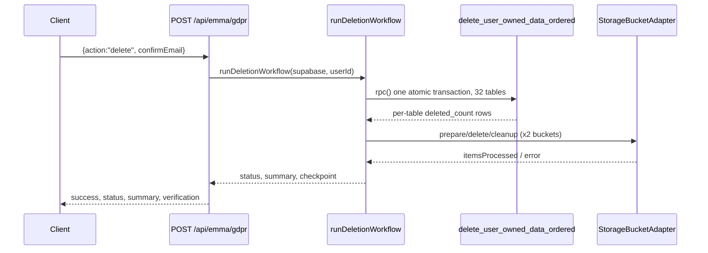
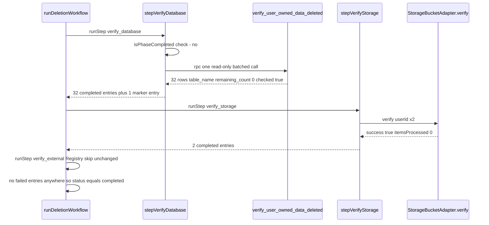
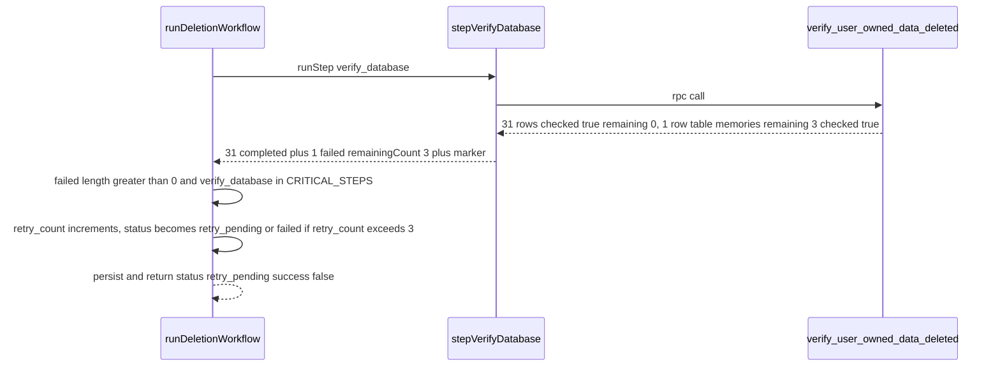
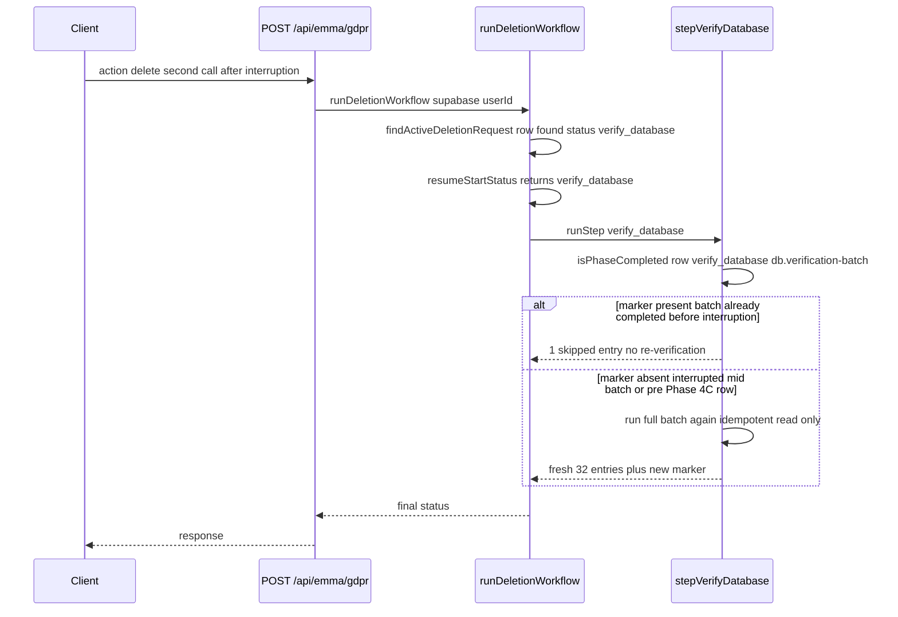
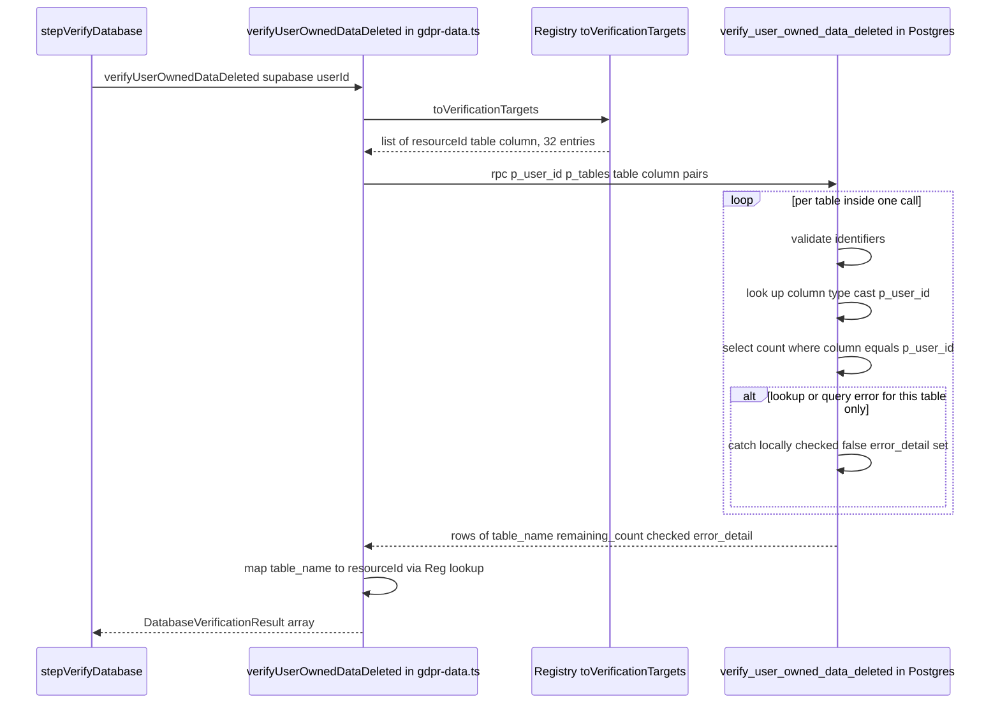
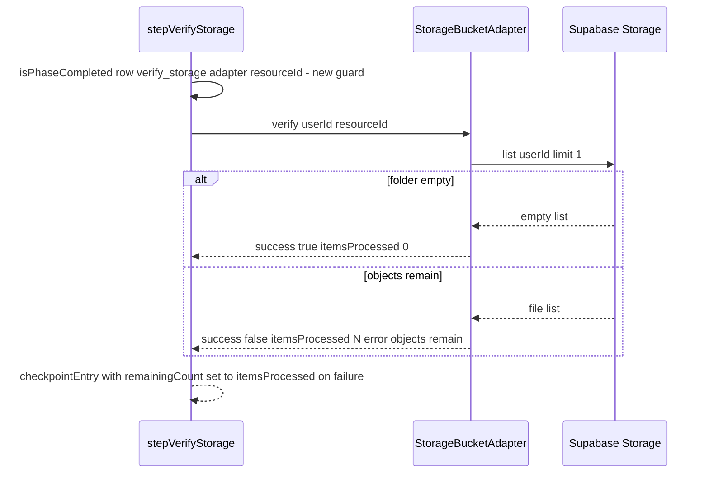

# Account Deletion — Phase 4B Technical Design Document (Verification Architecture)

**Status:** Design only. No code, SQL, migration, or test file has been created or modified by this document. Implementation-ready for Phase 4C.
**Written:** 2026-07-18.
**Roadmap:** [Account Deletion Roadmap v1.0 (Frozen)](../roadmaps/account-deletion-roadmap-v1.md) — Phase 4 (Verification), Engineering Workflow step 7 ("Technical Design (TDD)").
**Authority:** [ADR-0005](../adr/0005-account-deletion-verification-architecture.md) (Accepted, 2026-07-18) — every decision below implements one of its Chosen Architecture items (1–7) or resolves one of its Phase-4B-owned Open Questions. No item of ADR-0005 is reopened, reinterpreted against its own text, or superseded here.
**Baseline implementation reviewed:** `src/core/account-deletion/registry.ts`, `adapter.ts`, `workflow.ts`, `workflow-types.ts`, `gdpr-data.ts`, `adapters/storage-bucket-adapter.ts`, `adapters/registry-adapters.ts`; `src/app/api/emma/gdpr/route.ts`; `src/app/settings/privacy/page.tsx`; `supabase/migrations/20260715000001_deletion_requests.sql`, `20260716000001_transactional_deletion.sql`; `vercel.json`.

---

## How to read this document

Each section states a **decision**, the **ADR-0005 item or Open Question it satisfies**, the **exact current code it extends** (file:line), and the **rationale** for the specific mechanism chosen where more than one mechanism would have satisfied the ADR's binding text. Where a genuine implementation-level fork existed that ADR-0005 left to Phase 4B, that fork is resolved explicitly, not left implicit. Nothing here revisits Alternative A vs. B vs. C, the Registry's shape, the `DeletionAdapter` interface's shape, or `STATE_ORDER`'s membership — all four are inherited as fixed inputs.

---

## 1. Registry Design

**Satisfies:** ADR-0005 Chosen Architecture item 1.

### 1.1 `verificationAdapter` population

| Registry entry group                                                                                                | Current value | Phase 4B value                | Rationale                                                                                                                                                                                                                                                                                                                                                                                                                                                                                                                                                                                                                   |
| ------------------------------------------------------------------------------------------------------------------- | ------------- | ----------------------------- | --------------------------------------------------------------------------------------------------------------------------------------------------------------------------------------------------------------------------------------------------------------------------------------------------------------------------------------------------------------------------------------------------------------------------------------------------------------------------------------------------------------------------------------------------------------------------------------------------------------------------- |
| 32 `DatabaseResourceEntry` rows (`registry.ts:86-494`)                                                              | `null`        | `"database-row-count-verify"` | Mirrors the existing `deletionAdapter: "legacy-table-delete"` labeling convention (ADR-0004: "a label... not a literal adapter object") for the identical reason: 32 tables are verified together, by one function, not per-table adapter objects.                                                                                                                                                                                                                                                                                                                                                                          |
| 2 Storage `OtherResourceEntry` rows (`storage.document-ingestion`, `storage.task-documents`, `registry.ts:502-527`) | `null`        | **Stays `null`**              | `DeletionAdapter.verify()` is already real for Storage (`storage-bucket-adapter.ts:40-57`) and is resolved through `deletionAdapter === "storage-bucket-delete"` in `registry-adapters.ts:17-19`, not through a separate field. Adding a `verificationAdapter` value here would imply a second resolution mechanism exists for Storage verification; none is being built (ADR-0005 explicitly flags this as "arguably already satisfied"). Leaving it `null` documents that the existing `deletionAdapter`-driven resolution already covers verification for this resource type — a deliberate non-value, not an oversight. |
| `oauth.client_integrations`, `background.document_process` (`registry.ts:528-553`)                                  | `null`        | **Stays `null`**              | No deletion adapter exists for either (`deletionAdapter: null`); verifying the absence of something nothing deletes is not meaningful (ADR-0005 Future Considerations). Populating a verification label here without a deletion adapter would be speculative — nothing would ever call it.                                                                                                                                                                                                                                                                                                                                  |
| `excluded.ingested_whatsapp` (`registry.ts:554-566`)                                                                | `null`        | **Stays `null`**              | Out-of-scope resource; unchanged.                                                                                                                                                                                                                                                                                                                                                                                                                                                                                                                                                                                           |

### 1.2 Naming convention

`"database-row-count-verify"` follows the existing `-delete` suffix convention (`"legacy-table-delete"`, `"storage-bucket-delete"`) with a `-verify` suffix, so a future reader scanning the Registry recognizes the pattern immediately: `<mechanism>-<action>`.

### 1.3 Registry ownership, lifecycle, validation rules

- **Ownership:** unchanged — `registry.ts` remains the sole inventory. No new field is added to `ResourceEntryBase`; only existing `verificationAdapter: string | null` values change from `null` to a populated string on the 32 database entries.
- **Lifecycle:** the value is set at Phase 4C implementation time (a one-line change per entry, or a shared constant referenced by all 32 `db()` calls — implementation detail, not a design decision) and is static thereafter; it does not change per-request.
- **Validation rule (new, additive):** `getResourcesByPhase("deleting_database")` (`registry.ts:612-614`) already returns all 32 database entries regardless of `verificationAdapter`. A new derivation, `getVerifiableDatabaseResources()`, filters that list to entries where `verificationAdapter === "database-row-count-verify"` before constructing the batch RPC payload (§4). This is the Registry-side validation rule: **a database resource is included in a verification batch call if and only if its `verificationAdapter` is non-null** — mirroring exactly how `getStorageDeletionAdapters()` already filters on `deletionAdapter === "storage-bucket-delete"` (`registry-adapters.ts:17-19`) rather than assuming every `OTHER_RESOURCES` entry has a real adapter. This keeps the Registry, not the workflow, as the single place that decides which resources are verification-eligible — consistent with every prior phase's own stated design principle, and future-proofs the mechanism for a hypothetical future database resource added with `verificationAdapter: null` (e.g., a table intentionally excluded from verification for a documented reason, the same way `excluded.ingested_whatsapp` is already excluded from deletion).

### 1.4 No new Registry fields

Confirmed no new field is introduced on `ResourceEntryBase`, `DatabaseResourceEntry`, or `OtherResourceEntry`. `Assumption #4` in ADR-0005's Architectural Assumption Summary — "Registry integration means populating the existing field, not adding new fields" — is satisfied exactly as assumed.

---

## 2. Verification Adapter Design

**Satisfies:** ADR-0005 Chosen Architecture items 1, 2, 4; Design Goal 1 ("re-list, don't trust `delete()`'s return value").

### 2.1 Why database verification is not a `DeletionAdapter`

Identical reasoning to ADR-0004's "Why database resources don't use the `DeletionAdapter` interface" (TDD, `../plans/2026-07-16-account-deletion-technical-design.md:78-80`): 32 tables are verified as one batched read (§4, §8 — the batching requirement, Chosen Architecture item 6), not as 32 independent adapter instances each implementing `prepare`/`delete`/`verify`/`cleanup`. Introducing a `VerificationAdapter` interface parallel to `DeletionAdapter` for database resources would create a second per-resource object contract for something that is architecturally one call — exactly the "conflating two risk profiles" mistake the discovery report already rejected for the SQL layer (§7 of the discovery report), recurring one layer up in TypeScript if repeated here.

### 2.2 The two verification mechanisms, by resource type

| Resource type                    | Verification mechanism                                               | Object/function                                                                         | New in Phase 4B?                                   |
| -------------------------------- | -------------------------------------------------------------------- | --------------------------------------------------------------------------------------- | -------------------------------------------------- |
| Database (32 resources)          | One batched read-only RPC call, wrapped by a new TypeScript function | `verifyUserOwnedDataDeleted()` in `gdpr-data.ts` (new, mirrors `deleteUserOwnedData()`) | Yes — new function, new SQL function it calls (§3) |
| Storage (2 resources)            | `DeletionAdapter.verify()`, already real                             | `StorageBucketAdapter.verify()` (`storage-bucket-adapter.ts:40-57`)                     | No — reused unchanged                              |
| External: OAuth, background jobs | No adapter exists; stays a Registry-driven "skipped" pass-through    | `stepVerifyExternal()` (`workflow.ts:324-333`), logic unchanged                         | No — reused unchanged                              |

There is exactly one new component in this entire design: `verifyUserOwnedDataDeleted()` (TypeScript) and the SQL function it calls (§3). Everything else in this section is reuse.

### 2.3 `verifyUserOwnedDataDeleted()` — responsibilities, inputs, outputs, failure modes

Placed in `gdpr-data.ts` alongside `deleteUserOwnedData()`, following the same shape:

- **Responsibilities:** derive the verification target list from the Registry (via `getVerifiableDatabaseResources()`, §1.3), issue exactly one `supabase.rpc(...)` call, and map the RPC's tabular result into a typed, per-resource result array. It does not decide workflow outcome — that is `stepVerifyDatabase`'s job (§4) — it only reports what it found.
- **Inputs:** `supabase` (RPC-capable client, same `Pick<SupabaseClient, "rpc">` shape `deleteUserOwnedData()` already uses), `userId: string`.
- **Outputs:** `Promise<DatabaseVerificationResult[]>`, one entry per verifiable resource:
  ```
  interface DatabaseVerificationResult {
    resourceId: string;      // Registry resourceId, e.g. "db.memories"
    table: string;
    checked: boolean;        // false only if this table's own check errored
    remainingCount: number | null;   // null iff checked === false
    errorDetail?: string;    // set only if checked === false
  }
  ```
  The mapping from the RPC's `table_name`-keyed rows back to Registry `resourceId`s is done in TypeScript (a `Map<table, resourceId>` built once from `getVerifiableDatabaseResources()`), not in SQL — the SQL function only knows about tables/columns, exactly as `delete_user_owned_data_ordered` only knows about tables/columns and never resourceIds (`gdpr-data.ts:32-35` passes `{table, column}` pairs, not resourceIds, to the existing delete RPC — the new function follows the same precedent).
- **Failure modes:**
  1. **Whole-call failure** (network error, RPC not found, permission denied): the single `supabase.rpc(...)` call itself rejects or returns a top-level `error`. `verifyUserOwnedDataDeleted()` does not catch this — exactly like `deleteUserOwnedData()` (`gdpr-data.ts:36`, `if (error) throw new Error(error.message);`), it re-throws, and the caller (`stepVerifyDatabase`, §4) is responsible for catching it, consistent with how `stepDeletingDatabase` catches `deleteUserOwnedData()`'s throw (`workflow.ts:228-237`).
  2. **Per-table failure** (a specific table's identifier lookup or count query errors — the `document_chunks.user_id`-missing scenario Phase 3.1 disclosed): reported as `{checked: false, remainingCount: null, errorDetail}` for that one table, with every other table's result unaffected. This is a genuine, deliberate difference from the delete function's all-or-nothing transactional failure mode — see §3.5 for why.
- **Evidence returned:** the full `DatabaseVerificationResult[]` array — every table gets a result, whether or not it was checkable. This satisfies "produce auditable evidence" (roadmap Success Criteria) for the failure case, too: an inconclusive check is itself evidence, not an absence of evidence.

### 2.4 How this differs from deletion while reusing existing infrastructure

| Property                         | `deleteUserOwnedData()` (existing)                                 | `verifyUserOwnedDataDeleted()` (new)                                                                                                               |
| -------------------------------- | ------------------------------------------------------------------ | -------------------------------------------------------------------------------------------------------------------------------------------------- |
| Mutates data                     | Yes                                                                | No — read-only                                                                                                                                     |
| Transactional atomicity required | Yes (compliance-critical: partial deletion is a real defect)       | No (a read has no partial-state hazard to roll back)                                                                                               |
| Failure granularity              | Whole-call (any table's failure aborts the transaction, by design) | Per-table (one table's failure does not prevent reporting on the other 31 — see §3.5)                                                              |
| Source of table/column list      | Registry, via `toUserOwnedDeleteOrder()`                           | Registry, via a new `toVerificationTargets()` (§3.2) — same Registry, same derivation pattern, filtered to `verificationAdapter`-populated entries |
| RPC call count                   | One, for all 32 tables                                             | One, for all verifiable tables (§8 batching requirement)                                                                                           |

---

## 3. Database Verification Design

**Satisfies:** ADR-0005 Chosen Architecture item 2 (the one new component), item 6 (batching).

No SQL is written here — this section specifies the function's contract precisely enough that Phase 4C's SQL is a direct transcription, not a design exercise.

### 3.1 Interface

- **Name:** `verify_user_owned_data_deleted` (mirrors `delete_user_owned_data_ordered`'s naming pattern exactly: `<action>_user_owned_data_<qualifier>`).
- **Parameters:**
  | Name | Type | Description |
  | --- | --- | --- |
  | `p_user_id` | `uuid` | Same parameter as the delete function; the user being verified. |
  | `p_tables` | `jsonb` | Array of `{table, column}` objects — same shape `p_tables` already has in the delete function. Populated from `toVerificationTargets()` (§3.2), **not** from `toUserOwnedDeleteOrder()` directly, so a database resource can be excluded from verification independently of being included in deletion (§1.3's validation rule). |
- **Return shape:** `TABLE(table_name text, remaining_count integer, checked boolean, error_detail text)` — one row per input table, always, regardless of whether that table's own check succeeded.

### 3.2 `toVerificationTargets()` (Registry derivation, `registry.ts`)

A new pure function alongside `toUserOwnedDeleteOrder()`:

```
toVerificationTargets(): ReadonlyArray<{ resourceId: string; table: string; column?: string }>
```

Filters `DATABASE_RESOURCES` to entries where `verificationAdapter !== null`, returning `resourceId` in addition to `table`/`column` (unlike `toUserOwnedDeleteOrder()`, which only needs `table`/`column` because the delete function doesn't need to report back per-resource — the verification caller does, per §2.3's `resourceId`-keyed output). `gdpr-data.ts`'s `verifyUserOwnedDataDeleted()` uses the `resourceId` field to build its `table → resourceId` lookup (§2.3) and strips it before constructing `p_tables` (the SQL function itself never sees `resourceId` — same separation of concerns as the delete function, which also never sees Registry metadata beyond `table`/`column`).

### 3.3 Expected results

For a fully-deleted user against a schema-complete environment: every row has `remaining_count: 0`, `checked: true`, `error_detail: null`. This is the expected steady-state result and is what `stepVerifyDatabase` (§4) maps to 32 `"completed"` checkpoint entries.

### 3.4 Batching

One RPC call verifies all ~32 tables (Chosen Architecture item 6 — binding, not discretionary). The function loops over `p_tables` internally, exactly as the delete function already does, issuing one `SELECT count(*)` per table inside that single call rather than one round-trip per table from the application layer. This is the only way to satisfy the "single batched call" requirement without changing `p_tables`'s shape.

### 3.5 Identifier validation, ownership-column casting — reused discipline; failure behaviour — deliberately different

**Identifier validation and column-type casting are reused byte-for-byte in discipline** (not code — this is a separate function): `v_table`/`v_column` are validated against `^[a-zA-Z_][a-zA-Z0-9_]*$` before use in dynamic SQL, and the actual column type is looked up from `information_schema.columns` so `p_user_id` is cast to match (`uuid` vs. `text`, per the four non-`uuid` columns Phase 2.1 already found) — the identical pattern `delete_user_owned_data_ordered` uses (`20260716000001_transactional_deletion.sql:63-69`, `:98-104`), for the identical reason (this is server-code-only input, but validation is defense in depth, not a trust-boundary substitute — same rationale, unchanged).

**Failure behaviour deliberately diverges from the delete function**, and this divergence is itself a Phase 4B design decision, not an oversight:

- **Malformed identifier** (a `table`/`column` value that fails the regex): this indicates a Registry/deployment bug, not a runtime data condition — the same class of defect the delete function also treats as fatal. **Raise an exception, abort the whole call.** A misconfigured Registry entry should fail loudly during Phase 4C's own testing, not be silently swallowed into a per-table "inconclusive" result that could ship undetected.
- **Unknown column** (the table exists but the named column doesn't — the exact `document_chunks.user_id`-missing scenario Phase 3.1 disclosed as a real, currently-existing environment condition on the linked validation project): **caught per-table, does not abort the call.** `remaining_count: null`, `checked: false`, `error_detail` set to the lookup failure. This is the one place this new function's error semantics must differ from the delete function's: the delete function's atomicity requirement means one bad table _should_ abort the whole transaction (a half-completed delete is a real defect). A read has no such requirement — aborting the entire verification because one table has a disclosed, already-known schema-tracking gap would mean **zero** tables get verification evidence instead of 31 out of 32, which is a strictly worse outcome for the exact auditability goal this phase exists to serve. Per-table exception handling (`EXCEPTION WHEN OTHERS` around each table's block, not around the whole loop) is what makes this possible.
- **Query execution failure** for a well-formed identifier (e.g. a transient lock, connection blip mid-loop): same per-table catch, same `checked: false` result.

This resolves the fork in ADR-0005's phrase "mirrors `delete_user_owned_data_ordered`'s safety pattern" precisely: the _safety pattern_ (identifier validation, type-aware casting, `SECURITY DEFINER` posture) is mirrored exactly; the _error-propagation pattern_ (whole-transaction abort) is not, because it exists in the delete function to serve atomicity, and atomicity is not a property a read-only verification needs or benefits from.

### 3.6 Security model / permission model

Identical posture to the delete function, for the identical reason (this function reveals whether specific user data exists — privacy-sensitive even though read-only, so it gets the same trust boundary, not a looser one because "it's just a read"):

- `SECURITY DEFINER`, `SET search_path = ''`, fully schema-qualified references (`public.%I`).
- `REVOKE ALL ... FROM PUBLIC, anon, authenticated; GRANT EXECUTE ... TO service_role` — only the server can call it, identical grant statement shape to `delete_user_owned_data_ordered` (`20260716000001_transactional_deletion.sql:119-120`).

---

## 4. Workflow Design

**Satisfies:** ADR-0005 Chosen Architecture items 3, 7.

### 4.1 `stepVerifyDatabase` — real body

Replaces the current pass-through (`workflow.ts:289-298`):

1. **Skip guard** (resume safety, §4.4): if `isPhaseCompleted(row, "verify_database", "db.verification-batch")` is true, return one `"skipped"` entry (`detail: "already completed"`) — mirrors `stepDeletingDatabase`'s exact guard shape (`workflow.ts:223-227`), including its synthetic, non-Registry resourceId convention (`"db.batch"` there; `"db.verification-batch"` here — see §4.4 for why this must be a _different_ synthetic id, not the same one, and why it must be _new_, not reused from the old pass-through).
2. Call `verifyUserOwnedDataDeleted(supabase, row.user_id)` (§2.3) inside a `try`/`catch`, exactly as `stepDeletingDatabase` wraps `deleteUserOwnedData()` (`workflow.ts:228-237`).
   - **On thrown error** (whole-call failure, §2.3 failure mode 1): emit **one** checkpoint entry, `resourceId: "db.verification-batch"`, `resourceStatus: "inconclusive"` (§6 — the new vocabulary value), `error: <message>`. Not `"failed"` — a broken RPC call is not evidence of leftover data, it's evidence verification itself didn't run (§9 elaborates the scenario-by-scenario rationale).
   - **On success:** map each `DatabaseVerificationResult` to one checkpoint entry:
     - `checked: true, remainingCount: 0` → `resourceStatus: "completed"`.
     - `checked: true, remainingCount: >0` → `resourceStatus: "failed"` (real, confirmed leftover data — the actual defect this phase exists to catch).
     - `checked: false` → `resourceStatus: "inconclusive"`, `error: errorDetail`.
       Every entry carries `remainingCount` (§6) when known.
3. **After** emitting all per-resource entries, append one more synthetic entry: `resourceId: "db.verification-batch"`, `phase: "verify_database"`, `resourceStatus: "completed"`, `detail: "batch verification executed"` — this is the skip-guard marker step 1 checks for, written last so a crash mid-mapping (between step 2 and this line) leaves the guard absent and a resume correctly re-runs the whole batch rather than falsely believing it finished (§4.4).

### 4.2 `stepVerifyStorage` — resume guard added, logic otherwise unchanged

`stepVerifyStorage`'s body (`workflow.ts:300-322`) already calls the real `StorageBucketAdapter.verify()` and already produces real `"completed"`/`"failed"` results — nothing about its verification logic changes. The one addition: a per-adapter skip guard, mirroring `stepDeletingStorage` exactly (`workflow.ts:243-250`):

```
if (isPhaseCompleted(row, "verify_storage", adapter.resourceId)) {
  entries.push(checkpointEntry("verify_storage", adapter.resourceId, "skipped", { detail: "already completed" }));
  continue;
}
```

No synthetic marker is needed here (contrast §4.4) — `verify_storage` has always produced genuine, non-placeholder results (unlike the old `verify_database`/`verify_external`, which only ever wrote `"skipped"` placeholders), so a pre-existing checkpoint entry for a given `adapter.resourceId` is already trustworthy evidence that that bucket was actually checked, not a stale placeholder.

### 4.3 `stepVerifyExternal` — synthetic marker added for consistency, logic unchanged

Logic is unchanged: still `getResourcesByPhase("deleting_oauth")` + `getResourcesByPhase("deleting_background_jobs")`, still emits `"skipped"` per resource (no deletion adapter exists for either, so verifying is not meaningful — unchanged from today, and correctly so per ADR-0005's Future Considerations). The one addition, for resume-safety consistency with `verify_database` (Chosen Architecture item 7 applies to "the verify steps," plural, without carving out an exception for the currently-inert one): an `isPhaseCompleted(row, "verify_external", "external.verification-batch")` guard around the whole step, same shape as §4.1. This has no observable behavior difference today (the step is idempotent regardless), but keeps all three verify steps structurally uniform, and means the guard is already correct on the day OAuth/background-job deletion adapters eventually ship (whenever that roadmap gap is resolved — not this phase's job to build, but also not this phase's job to leave inconsistent).

### 4.4 Why `verify_database`'s skip guard needs a _new_ synthetic resourceId, not the old per-resource entries

This is a compatibility hazard specific to this migration that neither ADR-0005 nor any prior review surfaced, and it is resolved here rather than left for Phase 4C to discover:

**The hazard:** today's `stepVerifyDatabase` pass-through (`workflow.ts:289-298`) already writes 32 `"skipped"` checkpoint entries — one per database `resourceId` — into `deletion_requests.checkpoint` for every request that has ever reached the `verify_database` phase since Phase 3 shipped. `isPhaseCompleted()`'s test is `e.resourceStatus !== "failed"` (`workflow.ts:172-180`) — `"skipped"` satisfies this. If Phase 4C's real `stepVerifyDatabase` checked `isPhaseCompleted(row, "verify_database", entry.resourceId)` **per database resourceId** (the naturally-symmetric choice, mirroring `stepVerifyStorage`'s per-adapter guard), then **any `deletion_requests` row that transited `verify_database` before the Phase 4C deploy would have its real verification permanently skipped on every future resume** — the old placeholder entries would be misread as "already verified," and the new code would never actually call `verifyUserOwnedDataDeleted()` for that row.

**The resolution:** use one synthetic, aggregate resourceId (`"db.verification-batch"`) for the skip-guard check — a string that cannot collide with any of the 32 real Registry `resourceId`s (which are all `"db.<table>"`-shaped) and that **the old pass-through code never wrote**, because it never had this resourceId to write. A row resumed post-deploy therefore always finds the guard absent (no entry with `resourceId === "db.verification-batch"` exists yet) and correctly re-runs the full batch exactly once — after which the new marker entry (§4.1 step 3) makes the guard present for any subsequent resume. This is the same pattern `stepDeletingDatabase` already established for exactly the same reason (one aggregate call needs one aggregate guard, not 32 individual ones) — reused, not invented.

The per-resource evidence entries (§4.1 step 2) are unaffected by this — they are still written every time the batch actually runs, at full 32-resource granularity, for reconciliation and audit purposes (§6). Only the _skip decision_ uses the aggregate marker.

---

## 5. Workflow Outcome Authority

**Satisfies:** ADR-0005 Chosen Architecture item 5 (binding — the central gap the Independent Review found and the Revision closed at ADR-altitude; this section is the HOW-altitude decision ADR-0005 explicitly deferred here).

### 5.1 The mechanism: widen `CRITICAL_STEPS`, gate only on `"failed"`

`CRITICAL_STEPS` (`workflow.ts:342`) currently reads:

```
const CRITICAL_STEPS: DeletionWorkflowStatus[] = ["deleting_database"];
```

**Decision: widen this to `["deleting_database", "verify_database", "verify_storage", "verify_external"]`.**

The existing branch this constant feeds (`workflow.ts:473`, `if (failed.length > 0 && CRITICAL_STEPS.includes(status))`) is **reused completely unmodified** — no new status-derivation code path is introduced. `failed` there is computed as `entries.filter((e) => e.resourceStatus === "failed")` (`workflow.ts:471`) — this filter, unmodified, **already excludes** the new `"inconclusive"` status value (§6) by construction, because `"inconclusive" !== "failed"`. This is why the vocabulary decision in §6 and the outcome-authority decision here compose correctly without any additional branching: a verification step producing only `"inconclusive"`/`"skipped"`/`"completed"` entries never enters this branch and the workflow proceeds to `completed` normally; a verification step producing even one `"failed"` entry (confirmed leftover data, or a genuine Storage failure) now escalates through the identical `retry_pending` → (after `MAX_RETRY_COUNT`) `failed` path deletion failures already use.

### 5.2 Why widen `CRITICAL_STEPS` rather than add a new terminal status

ADR-0005 Chosen Architecture item 3 states plainly: "No new states are added to `STATE_ORDER`." `deletion_requests`'s `status` column is constrained by `deletion_requests_status_check` (`20260715000001_deletion_requests.sql:27-34`) to the exact 15 values already enumerated — a new terminal value (e.g. `"completed_with_verification_gap"`) would require a `CHECK` constraint migration, which is explicitly out of the extension footprint ADR-0005 committed to ("Zero behavior change to the untouched foundation... only extended," Design Goal 5). Reusing `"failed"`/`"retry_pending"` — states that already exist, already mean "this workflow did not reach a clean, provable end state," and already have caller-facing handling (`privacy/page.tsx:65-76` already branches on `retry_pending` vs. other non-success outcomes) — satisfies the outcome-authority requirement with genuinely zero schema change and zero new client-side branches to build. A verification failure and a deletion failure become the same _kind_ of terminal outcome from the caller's perspective (the erasure is not provably complete; contact support / it will retry), which is the correct signal to send — the roadmap's Phase 4 objective is "the completion workflow must not be considered proof of successful deletion without a verification process," not "verification failures need their own distinct terminal vocabulary for the end user."

### 5.3 Why retry (not immediate permanent failure) is the correct default for a verification failure

Escalating a `verify_database` failure to `retry_pending` (rather than straight to `failed`) reuses `MAX_RETRY_COUNT = 3` (`workflow.ts:335`) unchanged. On resume, `resumeStartStatus()` (`workflow.ts:389-395`) returns the phase of the last checkpoint entry — for a `retry_pending` row whose last entry is a `verify_database` `"failed"` entry, resumption re-enters at `verify_database`, **not** `deleting_database` (since `isPhaseCompleted(row, "deleting_database", "db.batch")` is already true and that step is skipped). This means a verification-triggered retry does not re-attempt the deletion itself — it re-runs verification against the same, already-deleted state, which will reproduce the same `"failed"` result deterministically unless something external changed the data in the meantime (e.g. a straggling background write, or a manual intervention). After 3 such retries, the row becomes permanently `"failed"`, surfacing the same terminal outcome deletion failures already produce, for a human to investigate. This is not a new retry semantic invented for this phase — it is the existing generic "resume-with-backoff from the last checkpoint" behavior, applied to a step that now can fail for a new reason. Building a _smarter_ recovery (e.g. re-triggering deletion specifically for the tables verification found non-empty) is Reconciliation's job (roadmap Phase 6: "Detect and handle discrepancies... distinguish between permanent and temporary failures... generate follow-up recommendations") — explicitly out of Phase 4 scope, and this design does not attempt it.

### 5.4 What "inconclusive" does _not_ do, and why that is the correct default

An `"inconclusive"` result (schema drift, transient RPC failure) does **not** enter `CRITICAL_STEPS`' branch and does **not** block the workflow from reaching `completed`. This is a deliberate, narrow decision: ADR-0005's own Architectural Assumption Summary already carries "existence-based verification... validated for technical correctness; unresolved for compliance sufficiency" as an **open, Product/Legal-owned question**, not a Phase 4B decision to make. Treating "we could not check" as equivalent to "we confirmed a problem" would silently resolve that open question in the strictest possible direction (block completion on any inconclusive result) without the Product/Legal input ADR-0005 explicitly reserves for it. The chosen default — record the evidence durably (§6), surface it in the API (§7), let the workflow still reach `completed` — is the minimum commitment consistent with not completing without a verification process ever having run, while not overstepping into a governance decision this phase is not authorized to make. If Product/Legal later decide inconclusive results must block completion, that changes one filter predicate in this same branch (`e.resourceStatus === "failed"` → `e.resourceStatus === "failed" || e.resourceStatus === "inconclusive"`) — a small, contained, and already-anticipated future change, not an architecture rework.

### 5.5 Resulting `route.ts` semantics — unchanged code, strengthened meaning

`route.ts:111`'s `success: result.status === "completed"` is **not modified**. Its meaning is strengthened as a side effect of §5.1–§5.4: `"completed"` now can only be reached if every `CRITICAL_STEPS` phase — deletion **and** all three verification phases — produced zero `"failed"` entries. `success: true` therefore now means "deleted and independently verified with no confirmed residual data," not merely "the delete step returned without error," closing exactly the gap the Independent Review's §5 identified (`docs/plans/2026-07-18-account-deletion-adr-0005-independent-review.md:49-60`).

---

## 6. Checkpoint Design

**Satisfies:** ADR-0005 Chosen Architecture item 4; resolves the Open Question "Does `CheckpointResourceStatus` need a verification-specific vocabulary extension?"

### 6.1 `CheckpointResourceStatus` — resolved: extend to four values

```
export type CheckpointResourceStatus = "completed" | "failed" | "skipped" | "inconclusive";
```

**Decision: extend the type-level vocabulary. Do not rely on the `phase` field alone (the discovery report's §13 second option).**

Rationale: the `phase` field (`verify_database` vs. `deleting_database`) tells a consumer _which step_ produced an entry, but the workflow-outcome mechanism in §5 needs to distinguish, **within a single verification phase**, between "confirmed a real defect" (`"failed"` — must escalate) and "could not determine either way" (`"inconclusive"` — must not escalate, per §5.4). No combination of the existing three values plus the `phase` field expresses that distinction: `"skipped"` already means something different and stable ("no adapter configured," a design-time fact, unrelated to a specific check having been attempted and failed to resolve) and overloading it would blur two genuinely different situations an evidence consumer (this phase's own workflow, and Phase 6's future reconciliation) needs to tell apart. A fourth, dedicated value is a one-line, purely additive change to a `jsonb`-backed union type — no migration, no schema change, and (§10) no rollback hazard — and is the smaller change relative to inventing a parallel signaling mechanism (e.g. a boolean `inconclusive: true` flag alongside `resourceStatus`, which would just be the same information modeled less directly).

### 6.2 `CheckpointEntry` shape — one new optional field

```
export interface CheckpointEntry {
  phase: DeletionWorkflowStatus;
  resourceId: string;
  subResourceMarker: string | null;
  resourceStatus: CheckpointResourceStatus;   // now 4 values
  detail?: string;
  error?: string;
  recordedAt: string;
  remainingCount?: number;   // new — verification-only; undefined for deletion-phase entries
}
```

**Resolution of "verification result model" / "verification evidence model":** a single optional numeric field, not a nested `evidence` object. Rationale: the only new fact this phase needs to carry that the existing `detail`/`error` string fields don't already accommodate well is a machine-readable count (existing `detail` already carries human-readable summaries like `"31 items"` for Storage — `remainingCount` is the same fact, typed, for programmatic use by a future reconciliation pass rather than string-parsing `detail`). A nested object would only be justified if verification needed to carry more than one new structured fact; it doesn't. `remainingCount` is populated for:

- Database entries — the exact `remaining_count` the SQL function returned for that table.
- Storage entries, on failure — `StorageBucketAdapter.verify()` already returns `itemsProcessed` on its `DeletionAdapterResult` (`storage-bucket-adapter.ts:53-56`, the `files.length` case) — `stepVerifyStorage` (§4.2) now also copies that into `remainingCount` on the checkpoint entry it writes, unifying the evidence shape across resource types under one field rather than one convention for database and a different one (parsed from `detail`) for Storage.
- Left `undefined` for `"skipped"`/`"inconclusive"` entries where no count was ever obtained, and for all deletion-phase entries (unchanged, out of this phase's scope).

### 6.3 Timestamp behaviour

Unchanged — `recordedAt` (already present, ISO string, `workflow.ts:61`) continues to serve as "when this entry was written." No separate "checked at" timestamp is introduced; it would be redundant with `recordedAt` for every entry type this phase produces.

### 6.4 Phase transitions

Unchanged — no new phases are added to `DeletionWorkflowStatus` or `STATE_ORDER` (§5.2). The three existing verify phases (`verify_database`, `verify_storage`, `verify_external`) are the only phases this design writes checkpoint entries under.

### 6.5 Compatibility

- **Existing `checkpoint` rows** (any `deletion_requests` row that reached `verify_database`/`verify_storage`/`verify_external` before this phase ships) contain only `"skipped"`/`"completed"`/`"failed"` entries without a `remainingCount` field. Both are additive-compatible: `resourceStatus` is read as a string, not validated against an exhaustive enum at the database layer (it's `jsonb`); `remainingCount` is optional, so its absence on old entries parses as `undefined`, not an error, in any code that reads old rows.
- **`isPhaseCompleted()`** (`workflow.ts:172-180`) is unmodified and its `!== "failed"` test is unaffected by the new `"inconclusive"` value in exactly the way §4.4 already covers for the aggregate marker case, and in exactly the way any pre-existing `"skipped"`/`"completed"` per-resource entry continues to behave for `stepVerifyStorage`'s unchanged per-adapter guard (§4.2).
- **No migration is required** for this section's changes — `checkpoint` is, and remains, unconstrained `jsonb`.

---

## 7. API Design

**Satisfies:** ADR-0005 Production Impact Summary ("API contract: Additive only... can gain fields; no existing field's meaning changes").

### 7.1 Response model — one new, additive field

`POST /api/emma/gdpr`'s `{action: "delete"}` response (`route.ts:110-116`) gains one new top-level field, `verification`:

```
{
  success: boolean,          // unchanged field, strengthened meaning (§5.5)
  status: DeletionWorkflowStatus,  // unchanged
  deletedAt: string | null,  // unchanged
  summary: string[],         // unchanged — still one line per checkpoint entry, verify_* entries now included with real content instead of "skipped" placeholders
  verification: {            // new
    database: { verified: number; failed: number; inconclusive: number; skipped: number },
    storage:  { verified: number; failed: number; inconclusive: number; skipped: number },
    external: { verified: number; failed: number; inconclusive: number; skipped: number }
  },
  note: string                // unchanged
}
```

`verification` is computed by grouping the `result` row's final `checkpoint` array by phase (`verify_database` → `database`, `verify_storage` → `storage`, `verify_external` → `external`) and counting `resourceStatus` occurrences within each group. This is derived entirely from data `runDeletionWorkflow()` already returns via its `summary`/implicit checkpoint state — no new data source, purely a reshaping of already-computed evidence for API ergonomics (a client should not need to string-parse `summary` to answer "how many database resources were verified deleted").

### 7.2 Verification rollup — placement rationale

Placed as a sibling of `summary`, not nested inside it, and not replacing it — `summary`'s existing flat-string-array consumers (if any exist beyond `privacy/page.tsx`, which doesn't read `summary` at all today — confirmed at `privacy/page.tsx:56-76`) are unaffected by construction, and `verification` gives any future consumer (Phase 7's operator tooling, eventually) structured counts without needing to parse the human-readable strings.

### 7.3 Backward compatibility

- `success` and `status` keep their exact current types and truthy/falsy semantics — `privacy/page.tsx:59-76`'s existing `if (data.success) {...} else if (data.status === "retry_pending") {...} else {...}` branch structure requires **zero code changes** to keep working correctly, and now correctly reflects verification outcome too (§5.5), for free.
- `verification` is a new field an old client (one built before this phase, if any existed) simply never reads — no existing field is renamed, removed, or changes shape.
- This is the same compatibility posture ADR-0005's Production Impact Summary already asserted at ADR altitude ("`settings/privacy/page.tsx` already reads `status`/`success` rather than only `res.ok`... it already tolerates additional response detail without change") — confirmed still true against the current file in this section, not merely carried over from the ADR's own citation.

### 7.4 Client behaviour

**No change to `privacy/page.tsx` is required for correctness.** An optional, non-blocking Phase 4C enhancement (not a requirement of this design) would use the new `verification` field to enrich the failure message — e.g. distinguishing "deletion completed but verification found leftover data" from "deletion itself failed" — but the existing three-branch structure already produces a reasonable, non-misleading message in every outcome this design produces (a verification failure now correctly falls into the `retry_pending`/other-failure branches instead of the `success` branch, which is the actual defect this whole phase closes — see Independent Review §5).

### 7.5 Error propagation

Unchanged. `route.ts`'s outer `try`/`catch` (`route.ts:42`, `:123-126`) already catches anything `runDeletionWorkflow()` throws and returns a generic 500 — `verifyUserOwnedDataDeleted()`'s whole-call failure mode is caught one layer down, inside `stepVerifyDatabase` (§4.1), specifically so it becomes an `"inconclusive"` checkpoint entry and a normal (200, `completed` or `retry_pending`) response rather than an unhandled exception that would 500 the entire request over a verification hiccup. This asymmetry — deletion failures can legitimately throw up to the route handler in edge cases the existing code already handles that way; verification failures are deliberately absorbed one layer lower — is intentional: a verification outage should never turn a request that already successfully erased the user's data into a hard error response.

---

## 8. Runtime Design

**Satisfies:** ADR-0005 Chosen Architecture item 6 (binding batching requirement); Production Impact Summary's "Operational" row (`maxDuration` evaluation).

### 8.1 Batching strategy

- **Database:** one RPC call for all verifiable resources (§3.4) — the binding requirement. No per-table round trips from the application layer.
- **Storage:** two `adapter.verify()` calls (one per bucket), each a single `list(userId, {limit: 1})` call — already minimal, unchanged, not a batching concern at this scale (2 buckets, fixed).
- **External:** zero round trips — `stepVerifyExternal` remains a pure Registry read, no I/O (unchanged).

### 8.2 Timeout evaluation and `maxDuration` recommendation

`vercel.json`'s `functions` block currently has **16 route-specific `maxDuration` entries** and **no entry for `src/app/api/emma/gdpr/route.ts`** (confirmed directly against the file, `vercel.json:5-57`) — it runs on the Vercel platform default. This request's synchronous work, after this phase ships, is:

1. One atomic delete RPC (32 tables, already shipped, already the largest existing cost in this route).
2. Up to 2 best-effort Storage deletes (paginated `list`/`remove`, typically small per-user object counts).
3. **New:** one atomic verify RPC (32 tables, read-only — no lock contention with concurrent writers the way `DELETE` statements can have, so this is not expected to be slower than the delete call it mirrors, and is plausibly faster since it does no writes).
4. **New, but already-shipped-shape:** 2 Storage `verify()` calls (`list` only, `limit: 1` — near-instant).
5. External verification — no I/O.

**Recommendation: add an explicit `maxDuration: 60` entry for `src/app/api/emma/gdpr/route.ts`.**

Rationale for `60`, not a different value: this route now does one additional atomic, all-tables round trip on top of what it already did — structurally the same _shape_ of addition `src/app/api/emma/route.ts` (the brain streaming route, also `60`) represents relative to a simpler request, and meaningfully lighter than `src/app/api/emma/agent/route.ts` (`120`, which runs a multi-step agentic loop with multiple LLM calls — a different order of magnitude of synchronous work). `60` gives roughly double the headroom the delete-only path has needed in practice (no prior timeout incidents reported against this route) without over-provisioning to the agent route's tier for a request that, even with verification added, remains two atomic SQL calls plus a handful of Storage list operations — not an LLM loop. This is additive-only (Production Impact Summary already classified deployment risk in this same class as Phase 2's migration) and does not affect any other route's configuration.

### 8.3 Latency considerations

The read-only verify RPC is expected to be faster per-table than the delete RPC (no row locks acquired, no `DELETE` write I/O, no WAL generation) — the batching requirement (§3.4, item 6) bounds this to one network round trip regardless, so the dominant cost is Postgres-side table-scan/index-lookup time across 32 `count(*)` queries, not round-trip count. No index changes are anticipated to be necessary (the ownership columns already have whatever indexes back their use in the existing delete path's `WHERE` clause; a `count(*) WHERE column = $1` is the same index-usable shape as `DELETE ... WHERE column = $1`).

### 8.4 Retry policy

Unchanged — `MAX_RETRY_COUNT = 3` (`workflow.ts:335`), now also the bound for verification-triggered retries (§5.3). No new retry infrastructure, no new backoff schedule.

### 8.5 Scalability

Verification adds no new concurrency surface: `deletion_requests_one_active_per_user` (the existing unique index, `20260715000001_deletion_requests.sql:50-52`) already bounds one in-flight workflow per user, and the new verify RPC — being read-only — introduces strictly less lock contention risk than the write-heavy delete RPC it sits next to in the same request. Nothing about this design changes the platform's aggregate request-rate characteristics; each `deletion_requests` row is still processed by at most one concurrent `runDeletionWorkflow()` execution (optimistic concurrency control, Phase 3.1, unchanged).

---

## 9. Failure Model

**Satisfies:** the task's explicit enumeration requirement; grounds §5's outcome-authority design in concrete scenarios.

| #   | Scenario                                                                                                                                                                        | Expected behaviour                                                                                                                                                                         | Checkpoint result                                                                                                                                                                 | Workflow result                                                                                                                                                                                                                                                                    | API result                                                                                                                                                                                                                                      |
| --- | ------------------------------------------------------------------------------------------------------------------------------------------------------------------------------- | ------------------------------------------------------------------------------------------------------------------------------------------------------------------------------------------ | --------------------------------------------------------------------------------------------------------------------------------------------------------------------------------- | ---------------------------------------------------------------------------------------------------------------------------------------------------------------------------------------------------------------------------------------------------------------------------------- | ----------------------------------------------------------------------------------------------------------------------------------------------------------------------------------------------------------------------------------------------- | ---------------------------------- |
| 1   | Database verification: all 32 tables confirm 0 remaining rows                                                                                                                   | Normal, expected path                                                                                                                                                                      | 32 `"completed"` entries + 1 `"db.verification-batch"` marker                                                                                                                     | Proceeds to `completed`                                                                                                                                                                                                                                                            | `success: true`, `verification.database.verified: 32`                                                                                                                                                                                           |
| 2   | Database verification: one table reports `remaining_count > 0` (real leftover data — genuine defect)                                                                            | Confirmed defect surfaced, not masked                                                                                                                                                      | That table: `"failed"`, `remainingCount: N`; others: `"completed"`                                                                                                                | `verify_database` in `CRITICAL_STEPS` → `retry_pending` (or `failed` after 3 retries)                                                                                                                                                                                              | `success: false`, `status: "retry_pending"`/`"failed"`, `verification.database.failed: 1`                                                                                                                                                       |
| 3   | Database verification: `document_chunks.user_id`-missing (disclosed schema-drift scenario)                                                                                      | Per-table catch, not whole-call abort (§3.5)                                                                                                                                               | That table: `"inconclusive"`, `error: <lookup error>`; others: `"completed"`                                                                                                      | Not in the `"failed"` filter (§5.1) → proceeds to `completed`                                                                                                                                                                                                                      | `success: true` (if no other table failed), `verification.database.inconclusive: 1` — visible in the API, not silently swallowed                                                                                                                |
| 4   | Database verification RPC call itself fails (network/connection error)                                                                                                          | Whole-call catch (§4.1 step 2)                                                                                                                                                             | One `"db.verification-batch"` entry, `"inconclusive"`                                                                                                                             | Proceeds to `completed` (no `"failed"` entries produced)                                                                                                                                                                                                                           | `success: true`, `verification.database` shows the single inconclusive marker                                                                                                                                                                   |
| 5   | Storage verification: bucket lists remaining objects (genuine leftover — `StorageBucketAdapter.verify()`'s existing `success: false` case, `storage-bucket-adapter.ts:52-56`)   | Already-real logic, now load-bearing (§5.1)                                                                                                                                                | `"failed"`, `remainingCount: <files.length>`                                                                                                                                      | `verify_storage` now in `CRITICAL_STEPS` → `retry_pending`/`failed`                                                                                                                                                                                                                | `success: false` — this exact case was previously logged but silently ignored for outcome purposes (Independent Review §5); now correctly blocks a false "success"                                                                              |
| 6   | Storage verification: `list()` call itself errors (storage outage)                                                                                                              | Existing catch (`workflow.ts:313-319`), `resourceStatus: "failed"` today                                                                                                                   | Currently `"failed"` (storage errors are already treated as `"failed"`, not `"inconclusive"`, in the existing `stepVerifyStorage` code) — **left unchanged**, see rationale below | Now escalates via widened `CRITICAL_STEPS`                                                                                                                                                                                                                                         | `success: false`, `retry_pending`                                                                                                                                                                                                               | —                                  |
| 7   | External (OAuth/background jobs) verification                                                                                                                                   | No adapter exists; always skipped (unchanged)                                                                                                                                              | `"skipped"` per resource                                                                                                                                                          | Never enters the `"failed"` filter                                                                                                                                                                                                                                                 | `success` unaffected by this phase, as today                                                                                                                                                                                                    | `verification.external.skipped: N` |
| 8   | Workflow interrupted mid-`verify_database`, resumed later                                                                                                                       | Skip guard (§4.4) correctly re-runs the full batch (marker entry absent)                                                                                                                   | Full 32-entry re-evaluation, new marker appended                                                                                                                                  | Normal completion or failure per whatever the re-run finds                                                                                                                                                                                                                         | Same as scenarios 1–4, evaluated fresh                                                                                                                                                                                                          |
| 9   | Workflow interrupted mid-`verify_database`, resumed _after this phase's marker entry was already written_                                                                       | Skip guard finds the marker, step returns one `"skipped"` entry, does not re-run                                                                                                           | No duplicate 32-entry batch                                                                                                                                                       | Proceeds immediately                                                                                                                                                                                                                                                               | Reflects the prior run's results, already persisted                                                                                                                                                                                             |
| 10  | A `deletion_requests` row that transited `verify_database` under **pre-Phase-4C** code (old placeholder "skipped" entries, no marker present), resumed after this phase deploys | Marker absent (old code never wrote it) → skip guard correctly does not fire → full real verification runs for the first time                                                              | 32 new entries + marker, replacing/supplementing the stale old placeholders already in the array                                                                                  | Evaluated fresh, as scenario 1–4                                                                                                                                                                                                                                                   | First real verification for a previously-placeholder-only row                                                                                                                                                                                   |
| 11  | Unexpected exception (e.g. a TypeScript error in the table→resourceId mapping, not a Supabase error)                                                                            | Not specifically caught by `verifyUserOwnedDataDeleted()`; propagates to `stepVerifyDatabase`'s `try`/`catch` (§4.1 step 2), which treats _any_ thrown error identically to an RPC failure | One `"inconclusive"` marker entry, `error: <exception message>`                                                                                                                   | Proceeds to `completed` (not `"failed"`-filtered)                                                                                                                                                                                                                                  | `success: true` if nothing else failed — a code defect in the mapping layer degrades to "inconclusive," not a 500; the underlying TypeScript bug still needs fixing via normal testing (§14), but a production request is not hard-failed by it |
| 12  | Request timeout (verification pushes total execution past the platform's `maxDuration`)                                                                                         | Platform terminates the function; no response is returned to the client                                                                                                                    | Whatever was persisted via `persist()` calls already made before the timeout (checkpoint writes happen incrementally, per step, not only at the end — `workflow.ts:492`)          | Row is left in whatever `status` its last successful `persist()` call recorded (e.g. `verify_database` if verification was mid-flight)                                                                                                                                             | Client sees a request timeout/network error, not a JSON response — a subsequent request resumes the same row per the existing `findActiveDeletionRequest()` logic, unchanged by this phase                                                      |
| 13  | Permission failure calling the new RPC (e.g. a deploy sequencing error — migration not yet applied when code ships, or grant missing)                                           | RPC call itself errors (`42501`/function-does-not-exist)                                                                                                                                   | Caught as whole-call failure (scenario 4's path)                                                                                                                                  | Proceeds to `completed` with an inconclusive marker — **not** blocked, which is why deployment sequencing (§14) matters: this failure mode is silent from the workflow's own perspective, only visible via the `verification.database.inconclusive` count or checkpoint inspection | `success: true`, but verification silently never ran for that request — this is the concrete reason §14 requires migration-before-code sequencing, not just recommends it                                                                       |
| 14  | Schema mismatch broader than one column (e.g. a whole table missing on a given environment)                                                                                     | Same per-table catch as scenario 3 — `information_schema.columns` lookup returns no row, `checked: false`                                                                                  | `"inconclusive"` for that table                                                                                                                                                   | Unaffected, same as scenario 3                                                                                                                                                                                                                                                     | Same as scenario 3                                                                                                                                                                                                                              |

Scenario 13 is the one genuinely new operational risk this design introduces that did not exist for the delete function (whose migration-before-code sequencing failure would be loud — the delete RPC missing would throw and correctly fail the whole request, since `deleting_database` is already in `CRITICAL_STEPS`). A verification RPC missing is quiet by the deliberate design of §5.4 (inconclusive doesn't block completion) — §14 names the mitigation (deployment sequencing discipline, plus the `verification` API field being the visible signal an operator or automated check could monitor, once Phase 7 builds monitoring — explicitly out of this phase's own scope to build, but not out of scope to make _observable_).

---

## 10. Compatibility

**Satisfies:** the task's explicit compatibility enumeration; ADR-0005's "Zero behavior change to the untouched foundation" (Design Goal 5).

| Dimension                        | Assessment                                                                                                                                                                                                                                                                                                                                                                                                                                                                                                                                                                                                                                                                                                     |
| -------------------------------- | -------------------------------------------------------------------------------------------------------------------------------------------------------------------------------------------------------------------------------------------------------------------------------------------------------------------------------------------------------------------------------------------------------------------------------------------------------------------------------------------------------------------------------------------------------------------------------------------------------------------------------------------------------------------------------------------------------------- |
| **Backward compatibility (API)** | Purely additive (`verification` field, §7). No existing field renamed, removed, or reinterpreted in type. `success`'s _meaning_ strengthens (§5.5) but its type and the client's existing branch structure (`privacy/page.tsx`) require no change.                                                                                                                                                                                                                                                                                                                                                                                                                                                             |
| **Migration compatibility**      | One new, additive migration (the new SQL function, §3) — does not alter `delete_user_owned_data_ordered`, `deletion_requests`'s schema, or any other existing table/function/policy. Reversible via a `DROP FUNCTION` if ever needed, with no data-shape dependency created elsewhere.                                                                                                                                                                                                                                                                                                                                                                                                                         |
| **Registry compatibility**       | One field-value change across 32 existing entries (`verificationAdapter: null → "database-row-count-verify"`), plus one new pure derivation function (`toVerificationTargets()`, §3.2) and one new filter helper (`getVerifiableDatabaseResources()`, §1.3). No existing Registry consumer (`toUserOwnedDeleteOrder()`, `toGdprExportTables()`, `getResourcesByPhase()`) changes behavior.                                                                                                                                                                                                                                                                                                                     |
| **Checkpoint compatibility**     | Additive `jsonb` field (`remainingCount`) and additive union value (`"inconclusive"`) — old entries parse under the new type as entries that simply lack the optional field; nothing reads `checkpoint` with strict runtime schema validation that would reject an unrecognized-but-valid-JSON shape. **The one genuine compatibility hazard identified (§4.4) — old per-resource `"skipped"` placeholder entries being misread as completed verification — is resolved by the synthetic marker design, not merely noted as a risk.**                                                                                                                                                                          |
| **Workflow compatibility**       | `STATE_ORDER` unchanged (item 3). `CRITICAL_STEPS` widened (§5.1) — an additive change to a `const` array, not a structural change to the state machine's shape. `isPhaseCompleted()`, `persist()`, `resumeStartStatus()`, the optimistic-concurrency-control mechanism (Phase 3.1) — all unmodified.                                                                                                                                                                                                                                                                                                                                                                                                          |
| **Deployment compatibility**     | Same risk class as Phase 2's migration (Production Impact Summary, already assessed at ADR altitude) — one additive `SECURITY DEFINER` function, `service_role`-only grant, no destructive DDL. **Sequencing matters** (§14, §9 scenario 13): the migration must be applied before the Phase 4C code that calls it deploys, exactly as Phase 2's migration preceded Phase 2's code that called it.                                                                                                                                                                                                                                                                                                             |
| **Rollback compatibility**       | If Phase 4C's code is rolled back after having recorded `"inconclusive"` checkpoint entries in production: the _old_ `CheckpointResourceStatus` TypeScript type doesn't include `"inconclusive"`, but `checkpoint` is untyped `jsonb` at the database layer — old code reading a row with an `"inconclusive"` entry sees an ordinary string it doesn't have a named case for, and `isPhaseCompleted()`'s `!== "failed"` string comparison still evaluates correctly (`"inconclusive" !== "failed"` is `true`, same as `"skipped" !== "failed"`) — the old code does not crash, and treats such an entry as "not failed," which is a safe (if slightly imprecise) rollback behavior, not a data-corrupting one. |

---

## 11. Sequence Diagrams

### 11.1 Successful deletion (unchanged from Phase 3 — included for context)



### 11.2 Successful verification (new — this phase)



### 11.3 Verification failure (new — this phase)



### 11.4 Workflow resume (new interaction for verification; existing mechanism reused)



### 11.5 Database verification, detailed (new — this phase)



### 11.6 Storage verification (unchanged mechanism — included for completeness)



---

## 12. Requirements Traceability

Every ADR-0005 Chosen Architecture item maps to a concrete section of this design. No item is unaddressed; no design decision here lacks an ADR-0005 anchor.

| ADR-0005 Chosen Architecture item                                                                                     | This TDD's implementation design                                                                                                                                             |
| --------------------------------------------------------------------------------------------------------------------- | ---------------------------------------------------------------------------------------------------------------------------------------------------------------------------- |
| **1.** Populate `verificationAdapter` on database entries (label, no new fields)                                      | §1 — `"database-row-count-verify"` on all 32 `DatabaseResourceEntry` rows; Storage/OAuth/background-job entries stay `null`, each with stated rationale                      |
| **2.** New read-only, Registry-parameterized SQL function, mirroring the delete function's safety pattern             | §3 — `verify_user_owned_data_deleted` interface, identifier validation and casting discipline reused, error-propagation deliberately diverged (§3.5) with explicit rationale |
| **3.** `stepVerifyDatabase`/`stepVerifyExternal` get real bodies; no new `STATE_ORDER` states                         | §4.1 (`stepVerifyDatabase`), §4.3 (`stepVerifyExternal` — logic unchanged, guard added); §5.2 confirms no new states anywhere                                                |
| **4.** Verification evidence written into existing `checkpoint jsonb`, replacing `"skipped"` placeholders             | §4.1 step 2 (real per-resource entries replace the pass-through), §6 (`CheckpointEntry`/`CheckpointResourceStatus` evolution)                                                |
| **5.** Workflow outcome authority — verification failure must be capable of changing final `status`/`success`         | §5 in full — the `CRITICAL_STEPS` widening mechanism, its scoping to `"failed"` only, and the resulting `route.ts` semantics                                                 |
| **6.** Runtime duration — one batched call; evaluate `vercel.json` timeout headroom                                   | §3.4 (batching), §8.2 (`maxDuration: 60` recommendation with rationale)                                                                                                      |
| **7.** Resume safety — verify steps use the `isPhaseCompleted()` skip-guard pattern already proven for deletion steps | §4.1 step 1, §4.2, §4.3, and §4.4's detailed resolution of the one compatibility hazard this reuse surfaces                                                                  |

Both Design Goals not already covered by the items above are also traced:

| ADR-0005 Design Goal                                                                                          | This TDD's implementation                                                                                                                                                                                                                       |
| ------------------------------------------------------------------------------------------------------------- | ----------------------------------------------------------------------------------------------------------------------------------------------------------------------------------------------------------------------------------------------- |
| Goal 1 — independently re-check, mirroring `StorageBucketAdapter.verify()`'s re-list-don't-trust pattern      | §2 — the new SQL function is a fresh, independent read (`count(*)`), not a re-read of the delete function's own reported row counts                                                                                                             |
| Goal 2 — evidence must survive the deletion it documents                                                      | Unchanged from ADR-0005's own analysis (`deletion_requests` is not a Registry deletion target, `auth.users` is never deleted) — this TDD writes evidence into that same, already-durable substrate (§6), introducing no new durability question |
| Goal 3 — no new persistence model/registry/adapter contract unless demonstrably insufficient                  | Confirmed: zero new tables, zero new registries, zero new adapter interfaces (§2.1) — the one new component (§3) was already justified as necessary at ADR altitude, not reopened here                                                          |
| Goal 4 — deletion success and verification success must become distinguishable in the final observable status | §5 in full; §7 (API surfacing)                                                                                                                                                                                                                  |
| Goal 5 — zero behavior change to the untouched foundation                                                     | §10 (Compatibility) — every existing consumer, migration, and interface confirmed unmodified in shape                                                                                                                                           |

---

## 13. Open Question Resolution

Per ADR-0005's Open Questions table, four items were assigned to Phase 4B specifically; the other three remain explicitly out of this document's authority to resolve.

### 13.1 Resolved in this document (Phase 4B-owned)

| Question                                                                                                        | Resolution                                                                                                                                                                                                                                                                                      | Where      |
| --------------------------------------------------------------------------------------------------------------- | ----------------------------------------------------------------------------------------------------------------------------------------------------------------------------------------------------------------------------------------------------------------------------------------------- | ---------- |
| Does `CheckpointResourceStatus` need a verification-specific vocabulary extension?                              | **Yes — extend to four values** (`completed`/`failed`/`skipped`/`inconclusive`). Disambiguating via the `phase` field alone was evaluated and rejected: it cannot express "confirmed defect" vs. "could not determine" within one phase, which the outcome-authority mechanism (§5) depends on. | §6.1       |
| Verification result model — how does a resource's verification outcome get represented?                         | `DatabaseVerificationResult` (TypeScript, `gdpr-data.ts`) as the intermediate shape; `CheckpointEntry` (extended with `remainingCount`) as the persisted shape. One new optional field, not a nested evidence object — justified against the single new fact actually needed.                   | §2.3, §6.2 |
| Workflow outcome derivation — what specific mechanism makes verification failure load-bearing for final status? | Widen `CRITICAL_STEPS` to include all three verify phases; reuse the existing `failed`-entries branch unmodified; gate strictly on `resourceStatus === "failed"`, deliberately excluding `"inconclusive"`.                                                                                      | §5         |
| Verification evidence model — what does "evidence" concretely consist of, and where does it live?               | Per-resource `CheckpointEntry` rows (one per database table verified, unified in shape with Storage's existing per-adapter entries) plus one aggregate skip-guard marker per batched step, all in the existing `checkpoint jsonb` array.                                                        | §4.1, §6.2 |

### 13.2 Explicitly not resolved here (owned elsewhere, per ADR-0005)

| Question                                                                                                         | Owner                                              | Status in this document                                                                                                                                                                                                                                                                                                  |
| ---------------------------------------------------------------------------------------------------------------- | -------------------------------------------------- | ------------------------------------------------------------------------------------------------------------------------------------------------------------------------------------------------------------------------------------------------------------------------------------------------------------------------ |
| What evidentiary standard does "auditable evidence" require — existence-check sufficient, or something stronger? | Product/Legal                                      | **Not resolved.** §5.4 explicitly designs around this being unresolved (inconclusive results don't block completion) rather than assuming an answer. If Product/Legal later require a stricter standard, §5.4 names the exact single-line change that would implement it.                                                |
| Which future phase (if any) implements OAuth/background-job deletion adapters?                                   | Roadmap owner (Emma Engineering), via a future ADR | **Not resolved.** §1.1, §2.2, §4.3 all treat these resources' unverifiability as an inherited, unchanged condition — no design decision here assumes or depends on this ever being answered.                                                                                                                             |
| Does production share the linked validation project's schema-tracking gap (`document_chunks.user_id` etc.)?      | Ops (production schema access)                     | **Not resolved** — outside this document's authority. §3.5 and §9 (scenarios 3, 14) design the new function to handle this condition gracefully (per-table `"inconclusive"`, not a whole-call abort) precisely _because_ this question's answer is not yet known, not because this document assumes a particular answer. |

No question in §13.2 is treated as resolved by implication anywhere else in this document — each design decision that touches a related area (§3.5, §5.4, §9) is phrased to be correct regardless of how these three questions are eventually answered.

---

## 14. Production Readiness

### 14.1 Implementation risks

| Risk                                                                                                                                                                                                                                          | Mitigation designed into this TDD                                                                                                                                                                                                                                          |
| --------------------------------------------------------------------------------------------------------------------------------------------------------------------------------------------------------------------------------------------- | -------------------------------------------------------------------------------------------------------------------------------------------------------------------------------------------------------------------------------------------------------------------------- |
| The new SQL function inherits Phase 2.1's type/casting bug class (the `text`/`uuid` mismatch, the ambiguous-column-reference defect)                                                                                                          | §3.5/§3.6 mandate the identical identifier-validation and per-column-type-casting discipline; §14.3 mandates live-database validation before production reliance, following the exact Phase 2.1 methodology (not a new methodology invented here)                          |
| Deploy-sequencing failure (code ships before the migration, §9 scenario 13)                                                                                                                                                                   | §14.4/§14.5 state migration-before-code sequencing as a hard requirement, and name the silent-failure consequence explicitly so it cannot be waved off as a minor ordering preference                                                                                      |
| The `db.verification-batch`/`external.verification-batch` synthetic marker convention is a new pattern; a Phase 4C implementer could plausibly miss it and use per-resource guards instead (the "naturally symmetric" but wrong choice, §4.4) | §4.4 documents the hazard and its resolution at implementation-decision granularity, specifically so a Phase 4C implementer does not have to rediscover it                                                                                                                 |
| `CRITICAL_STEPS`'s doc comment (`workflow.ts:338-341`, "Only the atomic database step is retry/fail-critical...") becomes stale the moment this phase's code change lands                                                                     | Implementation-level housekeeping, not a design risk — flagged here so Phase 4C updates the comment alongside the constant, rather than leaving documentation drift of exactly the kind ADR-0004's own "Process consequence" section already warned this subsystem repeats |

### 14.2 Testing requirements

Following this codebase's own established discipline (unit coverage first, live-database validation before production reliance — the exact sequence Phase 2/2.1 and Phase 3/3.1 both followed):

- Unit tests (mocked Supabase client), extending the existing `tests/unit/deletion-workflow.test.ts` and `tests/unit/transactional-deletion-sql.test.ts` patterns:
  - `stepVerifyDatabase` against mocked RPC responses covering: all-clean, one table with `remaining_count > 0`, one table `checked: false`, whole-call throw, resume with marker present, resume with marker absent (including the pre-Phase-4C-row simulation, §9 scenario 10).
  - `stepVerifyStorage`'s new skip guard (mock a pre-existing `"completed"` entry, confirm no second `adapter.verify()` call).
  - `CRITICAL_STEPS` widening: confirm a `"failed"` entry in each of the three verify phases now produces `retry_pending`/`failed`, and confirm an `"inconclusive"`-only result set does not.
  - `gdpr.test.ts`/`gdpr-workflow-integration.test.ts`: confirm the new `verification` response field's shape and counts for representative scenarios.
- Live-database validation (mirroring Phase 2.1's methodology exactly): run the new SQL function against a real, disposable Supabase project, specifically exercising:
  - The full 32-table clean-verification path.
  - A forced non-zero `remaining_count` (insert a row after simulated deletion, confirm it's detected — the actual defect this phase must prove it catches).
  - The `document_chunks.user_id`-missing condition specifically, since it is a **known, currently-real** environment state (not hypothetical) on at least one project this codebase has already validated against (Phase 3.1) — confirm the per-table catch produces `"inconclusive"`, not a whole-call abort, under the real error Postgres actually raises for this condition (not just the shape this document assumes it raises).
  - Permission model: confirm `anon` and an authenticated user's own session both receive a permission-denied error calling the new function directly, exactly as Phase 2.1 verified for the delete function.

### 14.3 Validation strategy

Two-tier, matching precedent: unit tests gate Phase 4C's own PR; live-database validation is a distinct, disclosed follow-up pass (its own report, per this subsystem's established convention: Phase 2 → 2.1, Phase 3 → 3.1) before this phase's Production Readiness Report can claim the new function is production-sound, not merely code-complete. This TDD does not claim live validation has occurred — it hasn't; Phase 4B produces no code.

### 14.4 Rollback considerations

- **Code-only rollback** (revert the Phase 4C deploy, migration stays applied): safe — the new function remains present but uncalled; `CRITICAL_STEPS` reverts to its narrower list; any `"inconclusive"`-tagged checkpoint entries already written are read safely by the old code (§10, rollback compatibility row).
- **Migration rollback** (the new function is dropped after code depending on it has shipped): **not safe without a paired code rollback** — the RPC call would start failing for every request, which (per §9 scenario 4/13's design) degrades to `"inconclusive"` rather than hard-failing the request, so this is a silent degradation, not an outage, but it does mean verification silently stops happening entirely until either the function is restored or the code is rolled back too. Operationally: **never roll back the migration alone; roll back code first if a rollback of this phase is ever needed.**

### 14.5 Deployment sequencing

**Binding requirement, not a preference:** the new migration must be applied and confirmed present (`GRANT EXECUTE ... TO service_role` in effect) before the Phase 4C code that calls `verify_user_owned_data_deleted` is deployed — identical sequencing discipline to Phase 2's migration, which the same codebase already established and followed successfully. §9 scenario 13 names the exact, silent failure mode if this is inverted.

### 14.6 Live database validation requirements

Restated from §14.2 for emphasis, since it is the one testing requirement this phase cannot skip without repeating a known process gap: this subsystem's history (ADR-0004's "Process consequence," repeated for Phase 5 and for account deletion itself twice) is that skipping live validation before claiming production-readiness has already cost real rework twice. §14.2/§14.3 make live validation of the new function's type-casting behavior and its handling of the disclosed `document_chunks` condition a named, explicit requirement of Phase 4C's own production-readiness gate — not an implicit assumption this TDD leaves for Phase 4C to remember to do.

---

## Finalization

### Self-review against ADR-0005

- **All ADR-0005 Chosen Architecture items (1–7) are fully covered:** confirmed in §12's traceability table — every item maps to at least one concrete section, and every section in this document traces back to at least one ADR-0005 item or Design Goal.
- **No architectural decision has been modified:** the Registry stays inventory-only and gains no new fields (§1.4); the `DeletionAdapter` interface is untouched (§2.1); `STATE_ORDER` gains no new states (§5.2); Alternative A (extend existing substrate) is not reopened anywhere in this document — every design choice extends an already-approved extension point.
- **No implementation code has been produced:** confirmed — every code fragment in this document is illustrative (interfaces, type signatures, pseudocode-shaped `if` conditions used to explain existing/modified branch logic) rather than literal, compilable source. No file under `src/` was created or edited by this task.
- **No SQL has been produced:** confirmed — §3 specifies the new function's name, parameters, return shape, validation discipline, and error-handling behavior entirely in prose and tables; no `CREATE FUNCTION` statement, no `plpgsql` body, appears anywhere in this document.
- **No roadmap scope has been expanded:** grace period, scheduling, reconciliation automation, dashboards, and operator tooling are named only as reasons certain decisions stop where they do (§5.3, §5.4, §9's scenario-13 note, §14.6) — never as something this design begins building.
- **All Phase 4B technical decisions are documented:** §1–§11 constitute the complete technical design; §12 confirms nothing is missing relative to ADR-0005's own binding text.
- **All Phase 4B-owned Open Questions are resolved:** §13.1 resolves all four; §13.2 confirms the other three are correctly left to their assigned owners, with this design's correctness explicitly not depending on how they're eventually answered.
- **Every section traces back to ADR-0005:** confirmed via the "Satisfies:" line at the top of every numbered section, and consolidated in §12.
- **The design is implementation-ready for Phase 4C:** every new component (one SQL function signature, one TypeScript wrapper function, two Registry derivations, one workflow constant change, two workflow step bodies, one checkpoint type extension, one API response field) is specified at a level (exact names, exact file locations, exact existing line numbers extended) that requires no further architectural judgment calls to implement — the remaining Open Questions (§13.2) are, by design, ones whose answers this implementation does not need in order to be built correctly.

### Summary

**Technical decisions made:**

1. `verificationAdapter: "database-row-count-verify"` on all 32 database Registry entries; `null` retained (with rationale) for Storage/OAuth/background-job/excluded entries (§1).
2. One new function, `verifyUserOwnedDataDeleted()` (TypeScript) calling one new function, `verify_user_owned_data_deleted` (SQL) — read-only, Registry-parameterized, batched, per-table failure isolation deliberately diverging from the mutating delete function's whole-transaction-abort behavior (§2, §3).
3. `stepVerifyDatabase`/`stepVerifyExternal` given real bodies; `stepVerifyStorage` gains a resume-skip guard; a new synthetic aggregate-marker resourceId convention (`"db.verification-batch"`, `"external.verification-batch"`) resolves a genuine deploy-transition compatibility hazard the ADR/review chain did not surface (§4).
4. `CRITICAL_STEPS` widened to include all three verify phases, gated strictly on the new `"inconclusive"` value being excluded from the existing `"failed"`-only escalation filter — zero new branching logic, reuses the exact existing mechanism (§5).
5. `CheckpointResourceStatus` extended to four values; `CheckpointEntry` gains one optional `remainingCount` field — both purely additive to `jsonb`, no migration (§6).
6. `POST /api/emma/gdpr` gains one additive `verification` rollup field; no existing field changes shape or meaning (§7).
7. `maxDuration: 60` recommended for the GDPR route, with sizing rationale relative to comparable existing routes (§8).

**Deferred decisions** (explicitly, and only, those ADR-0005 assigned beyond Phase 4B): the evidentiary-standard question (Product/Legal), OAuth/background-job deletion-adapter phase ownership (roadmap owner, future ADR), and production schema-drift parity (Ops) — §13.2.

**Risks:** the new SQL function's inherited type-casting risk class; the deploy-sequencing silent-failure mode (§9 scenario 13); the new synthetic-marker convention needing to be followed precisely by whoever implements Phase 4C — all named with mitigations in §14.

**Assumptions:** none beyond those ADR-0005 already validated (its Architectural Assumption Summary) — this document introduces no new assumption of its own about production schema state, evidentiary sufficiency, or future roadmap phases; where those questions bear on a design choice (§3.5, §5.4), the choice is made to be correct independent of their eventual answer.

**Traceability to ADR-0005:** complete — §12.

---

## Related

- [ADR-0005: Account Deletion Verification Architecture](../adr/0005-account-deletion-verification-architecture.md) (Accepted)
- [Phase 4A Architecture Discovery Report](2026-07-18-account-deletion-phase4a-architecture-discovery.md)
- [ADR-0005 Independent Review](2026-07-18-account-deletion-adr-0005-independent-review.md) / [Revision](2026-07-18-account-deletion-adr-0005-revision.md) / [Acceptance Readiness](2026-07-18-account-deletion-adr-0005-acceptance-readiness.md) / [Final Independent Re-review](2026-07-18-account-deletion-adr-0005-final-review.md)
- [ADR 0004: Account Deletion Architecture](../adr/0004-account-deletion-architecture.md)
- [Account Deletion Technical Design Document (Phases 1–3)](2026-07-16-account-deletion-technical-design.md)
- [Account Deletion Roadmap v1.0 (Frozen)](../roadmaps/account-deletion-roadmap-v1.md)
- `src/core/account-deletion/registry.ts`, `adapter.ts`, `workflow.ts`, `workflow-types.ts`, `gdpr-data.ts`
- `src/app/api/emma/gdpr/route.ts`, `src/app/settings/privacy/page.tsx`
- `vercel.json`
