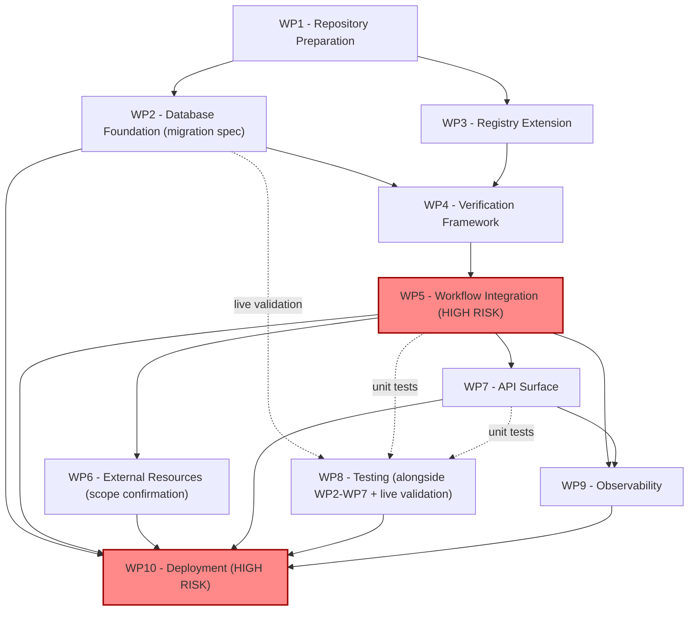

# Account Deletion — Phase 5A Implementation Planning

**Status:** Accepted. [Independent Planning Review](2026-07-20-account-deletion-phase5a-independent-review.md) found one MAJOR finding (an inaccurate PR-history precedent claim in WP1/Testing Strategy) and three MINOR/graph-completeness gaps — all corrected in this revision (see that document's own resolution note). No CRITICAL or unresolved MAJOR finding remains; the WP1–WP10 decomposition, dependency graph, risk register, and traceability matrix were independently re-verified against the repository and found otherwise sound.
**Written:** 2026-07-20.
**Roadmap:** [Account Deletion Roadmap v1.0 (Frozen)](../roadmaps/account-deletion-roadmap-v1.md) — Phase 4 (Verification), Engineering Workflow step 8 ("Implementation") **not yet begun**.
**Scope:** Planning only. No source code, SQL, migration, test file, or infrastructure change is created or modified by this document. This document decomposes the already-accepted [Phase 4B Technical Design Document](2026-07-18-account-deletion-phase4b-technical-design.md) into an implementation roadmap; it does not add, remove, or reinterpret any design decision within it.
**Authority treated as frozen and not reopened:** [ADR-0004](../adr/0004-account-deletion-architecture.md) (Accepted), [ADR-0005](../adr/0005-account-deletion-verification-architecture.md) (Accepted), [Phase 4A Architecture Discovery](2026-07-18-account-deletion-phase4a-architecture-discovery.md), the [Phase 4B TDD](2026-07-18-account-deletion-phase4b-technical-design.md) (Accepted, Revision 3) and its full four-round review chain, the [Phase 4C Production Readiness Review](2026-07-20-account-deletion-phase4c-production-readiness.md) (Decision: GO WITH MINOR FOLLOW-UPS), and the [Phase 4C Independent Production Audit](2026-07-20-account-deletion-phase4c-independent-audit.md) (Decision: GO WITH MINOR FOLLOW-UPS).

---

## A note on scope and naming, stated up front rather than left implicit

Per this subsystem's now-established convention (the same convention the [Phase 4C PRR](2026-07-20-account-deletion-phase4c-production-readiness.md) used for identical reasons): the task that produced this document is titled "Phase 5A," but this is **not** the roadmap's own **Phase 5 — Grace Period & Scheduling**, whose own stated prerequisite ("Depends on: Phase 4") means Phase 4 fully _implemented and hardened_, not merely designed. "Phase 5A" here means _the next step of Phase 4 itself_ — turning the already-accepted Phase 4B design into an executable implementation roadmap, immediately preceding Engineering Workflow step 8 ("Implementation"). Wherever "Phase 5" appears below without qualification, read it as "Phase 4's implementation planning," never the roadmap's Phase 5.

This document is also, precisely, a **planning artifact**, not an implementation-readiness re-assessment. That assessment already happened, twice, independently (the PRR and the Audit), and both concluded **GO WITH MINOR FOLLOW-UPS**. This document does not re-litigate that verdict — it takes it as its starting condition and answers a different question: _given the accepted design and the eight already-identified follow-ups, in what order, with what tests, and with what rollback posture should Phase 4C actually be built?_

---

## Planning Principles

Every work package and every sequencing decision below is constrained to preserve, not trade off against, the following — carried directly from the roadmap's Engineering Workflow, ADR-0004, and ADR-0005:

- **Registry-driven execution.** `registry.ts` remains the single inventory. No work package introduces a second source of truth for what is verified, deleted, or reported on.
- **Workflow idempotency.** The verify RPC is a pure read; the delete RPC's proven idempotency (Phase 2.1) is untouched. No work package introduces a mutating verification path.
- **Deterministic retries.** `MAX_RETRY_COUNT = 3` is reused unchanged (TDD §5.3, §8.4). No work package introduces new retry/backoff infrastructure.
- **Deterministic resume.** The two guard shapes TDD §4.1–§4.4 specify (aggregate marker for `verify_database`/`verify_external`; per-resource, push-nothing-on-fire for `verify_storage`) are implemented exactly as specified — this is the single highest-fidelity-risk property in the entire plan (see WP5, Risk Register items R1–R2).
- **Verification authority.** A verification failure must remain capable of changing `status`/`success` (ADR-0005 item 5, TDD §5.1) — no work package weakens or bypasses `CRITICAL_STEPS`'s widened scope.
- **Auditability.** Evidence lives in the existing `deletion_requests.checkpoint` substrate only (ADR-0005 item 4) — no work package introduces a parallel evidence store.
- **Backward compatibility.** `route.ts`'s existing fields (`success`, `status`, `deletedAt`, `summary`, `note`) keep their exact current types (TDD §7.3, §10) — no work package requires a `privacy/page.tsx` change for correctness.
- **Incremental delivery.** Work is planned so that implementation can be reviewed as a small number of coherent, testable slices (see "Why this is not ten separate PRs" under WP1) — not so atomized that a reviewer would be asked to approve a type-incomplete intermediate state.
- **Production safety.** The two follow-ups common to both the PRR and the Audit that are must-close-before-merge (Risk Register items R1–R2 below, sourced from the PRR's Risk Register items 10–11 and the Audit's MAJOR-1) and the one that is must-close-before-merge for deployment mechanics (R3, sourced from PRR Risk Register item 12 / Audit MAJOR-2) are each assigned to a specific work package below, not left as prose to remember.

No planning decision in this document contradicts ADR-0004, ADR-0005, or any accepted Phase 4B TDD section. Where this document makes an implementation-_sequencing_ judgment call the TDD itself is silent on (e.g., PR boundaries, migration-apply mechanics), that is disclosed explicitly as this document's own decision, not attributed to the TDD.

---

## Work Package Decomposition

### WP1 — Repository Preparation

**Objective:** Establish the branch, commit, merge, and release mechanics Phase 4C's implementation will use, and close the process half of Risk Register item R1/R2 (below) by making the two safety-critical regression tests a checked, not merely documented, precondition of merge.

**Dependencies:** None — can start immediately.

**Affected components:** Git branch/PR process and `.github/` PR template only. No `src/` or `supabase/` files.

**Why this is not ten separate PRs:** WP2–WP7 form one tightly coupled dependency chain — the SQL function's contract (WP2) is consumed by the Registry derivation (WP3), which is consumed by the TypeScript wrapper (WP4), which is called by the workflow steps (WP5), whose output shape is read by the API layer (WP7). A reviewer asked to approve WP3 in isolation could not meaningfully evaluate it without WP2's contract already in view, and an intermediate commit after WP5 alone would leave `route.ts` referencing a `DeletionWorkflowResult.checkpoint` field with no consumer — a type-complete but behaviorally incomplete state. This is a judgment call this plan makes on its own technical grounds, not a claim of directly-matching precedent: checked directly against PR history this session, Phase 2 and Phase 2.1 actually shipped _together_ in one PR (#128, "Account deletion: atomic transactional deletion + adapter lifecycle + Storage adapters (Phase 2 + 2.1)"), and Phase 3.1 shipped as direct commits to `main` with no PR of its own at all — so "one implementation PR, a later hardening PR" is not, in fact, an existing convention this repo has followed consistently; it is this plan's own recommendation, justified by WP2–WP7's coupling alone. Phase 4C should follow this shape:

- **PR 1 ("Phase 4C — Verification Implementation"):** WP2 (migration) + WP3 (registry) + WP4 (verification framework) + WP5 (workflow integration) + WP6 (external-resource scope confirmation) + WP7 (API surface) + WP8's unit/integration tests, written test-first per this repo's TDD-guide convention, one commit per step function or component with its own test — not one undifferentiated commit. WP9 (observability) is folded into WP5's commits (log-call additions live beside the step functions they instrument). This is one PR because it is one coherent, type-complete change; it is many commits because each commit should still be independently reviewable for _what it does_, even though none is independently _mergeable_.
- **PR 2 ("Phase 4C.1 — Live Validation & Hardening"), opened only after PR 1 merges and the migration has been applied to a disposable/staging project:** WP8's live-database validation report + any findings-driven fixes. Phase 2.1's own hardening pass (folded into PR #128 above, not a separate PR) and Phase 3.1's own hardening commits (direct to `main`, not a separate PR either) both nonetheless found real, mock-invisible bugs on first live validation — that outcome, not the PR boundary, is the precedent worth following: live validation should be expected to find something, and its findings should be reviewable as their own change set, whether that lands as a second PR (this plan's recommendation, chosen for review clarity) or as direct commits (this repo's own more common historical pattern).
- **WP10 (deployment)** is not a PR — it is an operational sequencing checklist executed around PR 1's merge (see WP10).

**Deliverables:**

1. Branch `feature/account-deletion-phase4c-impl`, cut from `main` at the point Phase 4C implementation begins (current `main` already includes the accepted TDD and both readiness documents via PR #135/#136).
2. A PR template checklist addition (or, if this repo's `.github/` has no PR template today, a checklist embedded in this WP's own tracking issue) with exactly these two items, sourced verbatim from the PRR's Risk Register items 10–11 and Audit MAJOR-1 — **this is the concrete closure of Audit MAJOR-1's own recommendation ("add these two risks to the Risk Register... so a PR reviewer checking the Risk Register alone would still be prompted")**:
   - [ ] "Resume with marker present and a prior failed per-resource entry" test present and passing (TDD §9 scenario 15; guards against reverting to per-resource `verify_database` guards).
   - [ ] Scenario-17 Storage retry test present and passing, asserting `verification.storage.verified === 2`, not `1`, and that the guard pushes no entry when it fires (guards against reverting to `stepDeletingStorage`'s always-push-`"skipped"` convention for `verify_storage`).

**Validation requirements:** Both checklist items exist in the PR template/tracking issue before WP2 begins; branch name matches this repo's established `feature/account-deletion-*` convention (confirmed via `git log`: `feature/account-deletion-phase4c` was the immediately preceding phase's branch).

**Rollback considerations:** N/A — process artifacts only.

**Implementation risk:** Low. The only risk is process discipline (the checklist being skipped at review time) — mitigated by WP1 making it a named PR-template item rather than prose in a design doc nobody re-reads at merge time.

---

### WP2 — Database Foundation

**Objective:** Plan the new migration implementing `verify_user_owned_data_deleted` (TDD §3) — the one genuinely new component in this entire design (TDD §2.2).

**Dependencies:** WP1 (branch exists). Independent of WP3 — can be implemented in parallel with it; only WP4 needs both complete.

**Affected components:** One new file, `supabase/migrations/<timestamp>_verify_user_owned_data_deleted.sql`. Zero changes to `20260715000001_deletion_requests.sql` or `20260716000001_transactional_deletion.sql` (TDD §10, "Migration compatibility": "does not alter... or any other existing table/function/policy").

**Expected deliverables (content, not SQL — no SQL is written in Phase 5A):**

- Function `verify_user_owned_data_deleted(p_user_id uuid, p_tables jsonb) RETURNS TABLE(table_name text, remaining_count integer, checked boolean, error_detail text)` (TDD §3.1).
- Identifier validation (`^[a-zA-Z_][a-zA-Z0-9_]*$`) and per-column-type casting via `information_schema.columns`, reused byte-for-byte in _discipline_ from `delete_user_owned_data_ordered` (TDD §3.5) — this is a direct transcription task for Phase 4C, not a design exercise.
- Failure-mode divergence from the delete function, **specified, not incidental** (TDD §3.5): malformed identifier → abort the whole call (Registry/deployment bug, should fail loudly in Phase 4C's own testing); unknown column or query failure → caught **per-table** (`EXCEPTION WHEN OTHERS` around each table's block, not the whole loop), producing `checked: false` for that table only.
- `SECURITY DEFINER`, `SET search_path = ''`, `REVOKE ALL ... FROM PUBLIC, anon, authenticated; GRANT EXECUTE ... TO service_role` — identical grant posture to the delete function (TDD §3.6).

**Migration sequence:** This is the _only_ new migration Phase 4C introduces. It has no ordering dependency on any other pending migration in `supabase/migrations/` (confirmed: the most recent migration, `20260716000001_transactional_deletion.sql`, is the delete function this one is modeled on and does not need to change).

**Compatibility strategy:** Purely additive (TDD §10, "Migration compatibility"). Reversible via `DROP FUNCTION` in isolation (TDD §14.4) — but see WP10 for why "reversible in isolation" is not the same as "safe to roll back independently of the code."

**Validation requirements:** Cannot be fully validated by unit tests (this is server-side SQL) — requires live-database validation against a real, disposable Supabase project, mirroring Phase 2.1's methodology exactly (TDD §14.2, second half): (1) the full 32-table clean-verification path, (2) a forced non-zero `remaining_count` (insert a row post-simulated-deletion, confirm detection — the actual defect class this phase exists to catch), (3) the `document_chunks.user_id`-missing condition specifically, since Phase 3.1 already disclosed this as a **currently real** environment condition, not a hypothetical one, (4) permission model — `anon` and an authenticated user's own session both receive permission-denied calling the function directly, exactly as Phase 2.1 verified for the delete function. This validation pass is WP8/PR2's job, not WP2's — WP2 only specifies what must be validated.

**Rollback considerations:** Safe to drop in isolation _only if the code calling it (WP4/WP5) has already been rolled back first_ (TDD §14.4 — "never roll back the migration alone"). See WP10 for the binding sequencing rule this implies for deployment, not just rollback.

**Implementation risk:** Medium-High. Inherits Phase 2.1's own found bug class (type/casting edge cases across the four known non-`uuid` ownership columns) — this is Risk Register item R4 below, carried forward unchanged from the PRR/Audit's own risk 9.

---

### WP3 — Registry Extension

**Objective:** Plan the `registry.ts` changes: populate `verificationAdapter` on the 32 `DatabaseResourceEntry` rows with `"database-row-count-verify"` (TDD §1.1), add `toVerificationTargets()` (TDD §3.2) and `getVerifiableDatabaseResources()` (TDD §1.3).

**Dependencies:** WP1 only — implementable in parallel with WP2; the two converge only at WP4.

**Affected components:** `src/core/account-deletion/registry.ts` only.

**Expected deliverables:**

- Field-value change (`verificationAdapter: null → "database-row-count-verify"`) on 32 entries, following the existing `"legacy-table-delete"`/`"storage-bucket-delete"` `<mechanism>-<action>` naming convention (TDD §1.2).
- `verificationAdapter` **stays `null`, with rationale preserved as an inline comment**, on the 2 Storage entries (already covered by `deletionAdapter`-driven resolution, TDD §1.1), the 2 external entries (`oauth.client_integrations`, `background.document_process` — no deletion adapter exists, verifying nothing is not meaningful), and `excluded.ingested_whatsapp` (out of scope, unchanged).
- `toVerificationTargets(): ReadonlyArray<{resourceId, table, column?}>` — filters to `verificationAdapter !== null`, returns `resourceId` in addition to `table`/`column` (unlike `toUserOwnedDeleteOrder()`, which doesn't need `resourceId` — TDD §3.2).
- `getVerifiableDatabaseResources()` — the Registry-side validation rule: a database resource is verification-eligible **iff** `verificationAdapter` is non-null (TDD §1.3), mirroring `getStorageDeletionAdapters()`'s existing filter pattern exactly.

**Registry metadata:** No new field is added to `ResourceEntryBase`, `DatabaseResourceEntry`, or `OtherResourceEntry` (TDD §1.4) — confirmed as a hard constraint, not a preference, by both ADR-0005 Assumption #4 and the TDD's own self-review.

**Compatibility layer:** None needed — `toUserOwnedDeleteOrder()`, `toGdprExportTables()`, `getResourcesByPhase()` are all confirmed unaffected in behavior (TDD §10, "Registry compatibility").

**Migration order:** Registry changes are pure, in-memory TypeScript — no independent deployment risk, no ordering dependency relative to WP2's migration beyond both needing to exist before WP4 can be implemented against them.

**Validation requirements:** `registry.test.ts` extended to assert: all 32 database entries have `verificationAdapter === "database-row-count-verify"`; the 5 non-database-verifiable entries (2 Storage + 2 external + 1 excluded) still have `verificationAdapter === null`; `toVerificationTargets()` returns exactly 32 entries with correct `resourceId`/`table`/`column` shape; `getVerifiableDatabaseResources()` filters identically.

**Rollback considerations:** Trivial — Registry is data plus pure functions, no persisted state, no migration.

**Implementation risk:** Low.

---

### WP4 — Verification Framework

**Objective:** Plan `verifyUserOwnedDataDeleted()` (TDD §2.3) in `gdpr-data.ts` — the TypeScript adapter layer between the workflow and the new SQL function. This is the one genuinely new component this entire design introduces (TDD §2.2); everything else in the design is reuse or extension of an existing mechanism.

**Dependencies:** WP2 (the SQL function's exact contract — name, parameters, return shape) and WP3 (`toVerificationTargets()`).

**Affected components:** `src/core/account-deletion/gdpr-data.ts` (new function, placed alongside the existing `deleteUserOwnedData()`, following its exact shape per TDD §2.3).

**Expected deliverables:**

- `verifyUserOwnedDataDeleted(supabase: Pick<SupabaseClient, "rpc">, userId: string): Promise<DatabaseVerificationResult[]>`.
- `DatabaseVerificationResult { resourceId, table, checked, remainingCount, errorDetail? }` — one entry per verifiable resource, always (TDD §2.3).
- `table_name → resourceId` mapping built in TypeScript via a `Map` constructed once from `getVerifiableDatabaseResources()` — never in SQL (TDD §2.3, mirrors how the delete function never knows about `resourceId`s either).

**Execution flow:** Derive target list from the Registry → issue exactly **one** `supabase.rpc(...)` call (the batching requirement, TDD §3.4/§8.1 item 6 — binding) → map tabular RPC result to the typed array. Does not decide workflow outcome — only reports what it found (TDD §2.3); outcome derivation is WP5's job.

**Verification contracts:** Two failure modes, both explicit per TDD §2.3: (1) **whole-call failure** (network error, RPC not found, permission denied) — not caught here, re-thrown exactly like `deleteUserOwnedData()`'s own unmodified re-throw pattern; caught one layer up, in WP5's `stepVerifyDatabase`. (2) **per-table failure** — reported as `{checked: false, remainingCount: null, errorDetail}` for that table only, every other table's result unaffected (TDD §2.3, §3.5).

**Batching behavior:** Single call for all ~32 tables — this WP is where the ADR-0005 item-6 binding requirement is actually implemented in application code, not just satisfied at the SQL layer (WP2 satisfies it server-side; WP4 satisfies it by never issuing more than one `rpc()` call per verification attempt).

**Error propagation:** No `try`/`catch` inside `verifyUserOwnedDataDeleted()` itself for the whole-call case — propagation is the caller's (WP5's) responsibility, matching the existing `deleteUserOwnedData()`/`stepDeletingDatabase()` split exactly (TDD §2.3, §4.1 step 2).

**Validation requirements:** Unit tests with a mocked Supabase client (`{rpc: vi.fn(...)}`) covering: all-clean response, one table `remaining_count > 0`, one table `checked: false`, whole-call throw. These are prerequisite tests WP5's own scenario-15/17 regression tests build on top of, not a substitute for them.

**Rollback considerations:** Code-only, no persisted state of its own — rollback is governed entirely by WP5/WP10's rules, not anything specific to this function.

**Implementation risk:** Low-Medium. The contract is fully specified (TDD §2.3 leaves no open fork); risk is limited to ordinary implementation-bug risk, not design ambiguity.

---

### WP5 — Workflow Integration

**Objective:** Plan the `workflow.ts`/`workflow-types.ts` changes: real bodies for `stepVerifyDatabase`/`stepVerifyExternal` (TDD §4.1, §4.3), `stepVerifyStorage`'s guard-and-mapping corrections (§4.2), the synthetic aggregate-marker convention (§4.4), required signature changes (§4.5), `DeletionWorkflowResult.checkpoint`/`checkpointEntry()` extension (§4.6), and `CRITICAL_STEPS` widening (§5.1).

**Dependencies:** WP3 (Registry derivations), WP4 (`verifyUserOwnedDataDeleted()`).

**Affected components:** `src/core/account-deletion/workflow.ts`, `src/core/account-deletion/workflow-types.ts`.

**This is the single highest-fidelity-risk work package in the plan.** Both of the Independent Production Audit's MAJOR findings, and 3 of the Phase 4B TDD review chain's 4 rounds, trace to mechanisms this WP implements. The two PR-merge-blocking regression tests named in the roadmap brief (see WP1, WP8) exist specifically because this WP's "obvious" implementation choice is the _wrong_ one at two separate points:

1. **`stepVerifyDatabase`'s skip guard must use the new synthetic resourceId `"db.verification-batch"`, not a per-resource guard** (TDD §4.4). The per-resource guard is "naturally symmetric" with `stepVerifyStorage`'s own guard shape and is exactly the choice a Phase 4C implementer not holding TDD §4.4 open would plausibly make — and doing so would let any `deletion_requests` row that transited `verify_database` under the old pass-through (which already writes 32 `"skipped"` placeholder entries, unconditionally, since Phase 3) have its real verification permanently, silently skipped forever, because the old placeholders would satisfy a per-resource guard.
2. **The marker's `resourceStatus` must be conditional** on whether any per-resource entry in the same batch is `"failed"` (TDD §4.1 step 3) — not written unconditionally `"completed"`. This was the original CRITICAL finding the Phase 4B review chain's first round found; it is reproduced here as an implementation-fidelity risk because nothing in the type system prevents a Phase 4C implementer from writing the simpler, unconditional version, which would silently reintroduce it.
3. **`stepVerifyStorage`'s per-resource guard must push nothing when it fires**, not a `"skipped"` placeholder (TDD §4.2, Revision 3) — diverging from `stepDeletingStorage`'s own adjacent, structurally similar guard, which _does_ push a placeholder. This divergence exists specifically because `stepVerifyStorage`'s output feeds a retry-sensitive rollup (WP7) that `stepDeletingStorage`'s does not — an implementer copying the more locally "obvious" precedent from three lines above would silently reintroduce the Storage-undercount defect Revision 3 closed.

**Expected deliverables, itemized against exact TDD anchors:**

- `stepVerifyDatabase(supabase, row)` — signature change from zero-arg (TDD §4.5); skip guard on `"db.verification-batch"` (§4.1 step 1, §4.4); calls `verifyUserOwnedDataDeleted()` in `try`/`catch` (§4.1 step 2); per-resource mapping (`remainingCount: 0` → `"completed"`, `>0` → `"failed"`, `checked: false` → `"inconclusive"`); conditional marker status written **last** (§4.1 step 3).
- `stepVerifyExternal(row)` — signature change (§4.5); guard added on `"external.verification-batch"` (§4.3); marker-write step using the **same conditional formula** as database (§4.3) — always `"completed"` today (no adapter exists to ever produce `"failed"`), specified conditionally so it is already correct the day an OAuth/background-job adapter ships.
- `stepVerifyStorage(row)` — no signature change (already takes `row`); guard body changed to push nothing on fire (§4.2 point 1); three-way failure mapping corrected: `success: true` → `"completed"`; `success: false && itemsProcessed > 0` → `"failed"`, `remainingCount: itemsProcessed`; `success: false && itemsProcessed === 0` **or** a caught exception → `"inconclusive"` (§4.2 point 2).
- `runStep()`'s switch statement updated to pass `supabase`/`row` through to the two changed step calls (§4.5).
- `CheckpointResourceStatus` extended to 4 values (`+ "inconclusive"`, TDD §6.1); `CheckpointEntry` gains optional `remainingCount?: number` (§6.2); `checkpointEntry()`'s `opts` gains `remainingCount?: number`, passed through identically to `detail`/`error` (§4.6).
- `DeletionWorkflowResult` gains `checkpoint: CheckpointEntry[]` (§4.6) — **every** `return` statement in `runDeletionWorkflow()` sets it (`row.checkpoint`, except `current?.checkpoint ?? row.checkpoint` in the `ConcurrentModificationError` branch) — stated as a blanket rule covering all 7 return statements per Revision 3's own correction of an earlier, incomplete enumerated version.
- `CRITICAL_STEPS` widened to `["deleting_database", "verify_database", "verify_storage", "verify_external"]` (§5.1) — the existing `failed.length > 0 && CRITICAL_STEPS.includes(status)` branch is reused completely unmodified.
- The stale doc comment at `workflow.ts:338-341` ("Only the atomic database step is retry/fail-critical...") is updated alongside the constant (TDD §14.1 — named explicitly as housekeeping, not a design risk, but real doc-drift if skipped).

**Checkpoint handling:** This WP is where the append-only, no-natural-key shape of `checkpoint` (the Independent Production Audit's MINOR-2/OBSERVATION — the root cause behind 3 of 4 TDD review rounds' findings) becomes load-bearing for the first time in a retry-sensitive way. WP5 does not change this shape (ADR-0005 Alternative B was rejected at ADR altitude for good reason, and this plan does not reopen it) — it implements the two specific, TDD-specified compensations (conditional marker status; push-nothing-on-guard-fire) that make the shape safe for this phase's actual read patterns.

**Retry semantics:** `MAX_RETRY_COUNT = 3` reused unchanged (§5.3, §8.4) — no new retry infrastructure.

**Workflow outcome authority:** §5.1's `CRITICAL_STEPS` widening is the single mechanism that makes a verification failure load-bearing for `status`/`success` — implemented here, nowhere else.

**Validation requirements:** See WP8 for the full test list; the two PR-merge-blocking regression tests (marker-defect resume test, TDD §9 scenario 15; Storage-undercount retry test, scenario 17) are specifically anchored to this WP's own three named hazards above.

**Rollback considerations:** Code-only rollback is safe (TDD §14.4) — `CRITICAL_STEPS` reverts to its narrower pre-Phase-4C list; old code reads any `"inconclusive"`-tagged entries safely (`"inconclusive" !== "failed"` string comparison, no crash, TDD §10 "Rollback compatibility").

**Implementation risk:** **High.** This is the plan's own explicit flag: implement this WP with TDD §4.1–§4.6 open side-by-side against the diff, not from memory of "what verification usually looks like" — every defect the four-round review chain found originated from a plausible-looking but wrong implementation choice at exactly this layer.

---

### WP6 — External Resources

**Objective:** Confirm, and keep confirmed, that OAuth (`oauth.client_integrations`) and background-job (`background.document_process`) verification remain deliberately unbuilt in Phase 4C — this WP exists to make that a checked non-scope, not an oversight.

**Dependencies:** WP5 (the `stepVerifyExternal` guard/marker addition already covers the only code change these resources need).

**Affected components:** None beyond WP5's `workflow.ts` changes. `registry.ts`'s existing `oauth.client_integrations`/`background.document_process` entries are not touched (both already `deletionAdapter: null`, `verificationAdapter: null`, and stay that way per WP3).

**Expected deliverables:** No implementation deliverable — this WP's output is a confirmation, recorded in `registry.test.ts` (WP3/WP8), that these two entries' fields are unchanged, plus a one-line note in the Phase 4C implementation PR description stating explicitly that external-resource verification adapters are out of scope (ADR-0005 Future Considerations; Roadmap Phase 4 "Out of Scope" implicitly covers this via its silence — no roadmap phase is currently assigned to build these).

**Adapter registration:** None planned. Building a real adapter for either resource type is unassigned to any phase on the current frozen roadmap (ADR-0005 Open Questions; PRR/Audit Risk Register item 4) — a future roadmap amendment via a new ADR would be required first, which is explicitly out of this document's authority.

**Retry behavior:** None — no I/O occurs for external resources today or after Phase 4C (`stepVerifyExternal` remains a pure Registry read, TDD §8.1).

**Validation requirements:** `registry.test.ts` assertion (folded into WP3's test work) that both entries' `deletionAdapter`/`verificationAdapter` fields are unchanged; no new test class is needed beyond what WP5's `stepVerifyExternal` tests already cover (guard fires correctly, marker written, always `"skipped"` today).

**Rollback considerations:** N/A — no new persisted state.

**Implementation risk:** Low. The only risk this WP guards against is scope creep — a well-intentioned Phase 4C implementer building a speculative partial adapter "since we're already in here," which ADR-0005 explicitly did not authorize and which would introduce exactly the kind of undiscovered scope expansion ADR-0004's own "Process consequence" section already warned this subsystem to avoid.

---

### WP7 — API Surface

**Objective:** Plan `route.ts`'s new `verification` response field (TDD §7.1–§7.5) — the second-most defect-prone piece of this design (2 of the review chain's 4 rounds found findings here).

**Dependencies:** WP5 (`DeletionWorkflowResult.checkpoint` must exist for `route.ts` to read from — TDD §4.6 is the data source; §7.1's algorithm has nothing to run against without it).

**Affected components:** `src/app/api/emma/gdpr/route.ts` only.

**Expected deliverables:**

- One new top-level field, `verification: {database, storage, external}`, each `{verified, failed, inconclusive, skipped}` — sibling of `summary`, not nested inside it, not replacing it (TDD §7.1, §7.2).
- The **two-step reduction algorithm**, in this exact order (TDD §7.1): (1) exclude synthetic marker entries (`resourceId === "db.verification-batch"` or `"external.verification-batch"`) — without this, a clean run reports `verified: 33`, not `32`; (2) deduplicate by keeping only the latest-`recordedAt` entry per `(phase, resourceId)` among the survivors of step 1 — without this, a retried-then-resolved request reports unbounded, potentially self-contradictory counts (e.g. `verified: 94, failed: 2` on a request whose final `status` is `"completed"`). Storage requires no dedup step by construction, once WP5's guard-body fix (item 3 above) is in place — there is never more than one real entry per `(phase, resourceId)` for `verify_storage` to begin with.
- Naming mapping stated explicitly in code comments: API `verified` ↔ checkpoint `resourceStatus === "completed"`; `failed`/`inconclusive`/`skipped` map identically by name (TDD §7.1 point 4).

**Status responses:** `success`, `status`, `deletedAt`, `note` are **unmodified** in type; `summary` is unmodified in shape (still `string[]`, now populated with real verify-phase content instead of `"skipped"` placeholders) — TDD §7.3 confirms zero `privacy/page.tsx` changes are required for correctness, and this plan does not add any.

**Audit endpoints:** None — no new endpoint is in scope. The only observability surface this phase introduces is the `verification` field itself (see WP9).

**Validation requirements:** `gdpr.test.ts`/`gdpr-workflow-integration.test.ts` extended to assert: a clean 32-table run reports `verification.database.verified: 32` (not 33 — catches a missing step-1 exclusion); the scenario-16 retry-then-resolve sequence reports `verification.database.verified: 32, failed: 0` on the final call (not `94`/`2` — catches a missing or wrong step-2 dedup); the scenario-17 mixed-outcome Storage sequence reports `verification.storage.verified: 2` (not `1` — catches a reintroduced Storage placeholder).

**Rollback considerations:** Additive field only — an old client (if one existed) simply never reads it; no migration, no shape change to any existing field (TDD §10 "Backward compatibility (API)").

**Implementation risk:** Medium-High. The dedup algorithm's correctness depends entirely on WP5's guard-body fix already being correct — these two work packages must be implemented and reviewed together, not independently, exactly as TDD §14.1's own Revision-3 risk entry states.

---

### WP8 — Testing

**Objective:** Plan the complete test surface per TDD §14.2, with the roadmap's own two named safety-critical regression tests made explicit, not folded anonymously into a longer list.

**Dependencies:** Runs alongside WP2–WP7 (test-first, per this repo's established TDD-guide convention — not deferred to a separate phase at the end), plus a distinct live-database validation sub-step gated on WP2's migration being applied to a disposable project and WP4/WP5/WP7 being code-complete.

**Unit tests** (mocked Supabase client, extending `tests/unit/deletion-workflow.test.ts` and `tests/unit/transactional-deletion-sql.test.ts`'s existing patterns):

- `stepVerifyDatabase`: all-clean, one table `remaining_count > 0`, one table `checked: false`, whole-call throw, resume with marker present, resume with marker absent (including the pre-Phase-4C-row simulation, TDD §9 scenario 10).
- **Regression test 1 (marker-defect resume — the roadmap's first named safety-critical test):** resume with the marker present _and_ a prior `"failed"` per-resource entry in the same batch (TDD §9 scenario 15). Assert `isPhaseCompleted(row, "verify_database", "db.verification-batch")` returns `false`, `verifyUserOwnedDataDeleted()` is called a second time, and the workflow does **not** silently reach `status: "completed"`/`success: true` on the retry.
- `stepVerifyStorage`'s skip guard (mock a pre-existing `"completed"` entry, confirm no second `adapter.verify()` call) and corrected failure mapping (`itemsProcessed > 0` → `"failed"`; `itemsProcessed === 0` or a caught exception → `"inconclusive"`).
- `CRITICAL_STEPS` widening: a `"failed"` entry in each of the three verify phases produces `retry_pending`/`failed`; an `"inconclusive"`-only result set does not.
- **Re-confirmation, not re-assertion, of the two existing tests TDD §10 flagged** (`deletion-workflow.test.ts`'s "tolerating unconfigured storage" test; `gdpr-workflow-integration.test.ts`'s delegation test) — run against the _actual_ Phase 4C implementation to confirm both continue observing `status: "completed"`/`success: true`. If either assertion needs to change, that is itself a signal WP5's mapping was implemented incorrectly and should block the PR, not be silently accepted.
- `gdpr.test.ts`/`gdpr-workflow-integration.test.ts`: `verification` field shape and counts, including the synthetic-marker exclusion (clean run → `verified: 32`, not `33`).
- **Regression test 2 (retry-then-resolve dedup):** the scenario-16 sequence, asserting `verification.database.verified === 32`, `failed === 0` on the final response — not `94`/`2`.
- **Regression test 3, the roadmap's second named safety-critical test (Storage-undercount):** the scenario-17 mixed-outcome sequence, asserting `verification.storage.verified === 2`, `skipped === 0` — not `verified: 1, skipped: 1` — **and** directly asserting `stepVerifyStorage`'s guard pushes no checkpoint entry when it fires (`entries` for that resourceId is empty for that call, not a `"skipped"` entry).

**Integration tests:** `gdpr-workflow-integration.test.ts` extended for the full request→workflow→response path with a mocked Supabase client exercising at least one verify-phase failure end-to-end.

**Regression tests:** Regression tests 1 and 3 above are the two named in WP1's PR-template checklist — treated as PR-merge-blocking, not optional coverage. Regression test 2 (scenario 16) is a third, closely related test that should ship alongside them for the same reason, though the roadmap brief names only the marker-defect and Storage-undercount tests explicitly.

**Interruption tests:** TDD §9 scenarios 8, 9, 12, plus the empty-`entries`-array edge case (§4.2's inline note — both `verify_storage` guards already satisfied on resume).

**Retry tests:** Scenarios 2, 5, 15, 16, 17 (the review chain's own central focus — already covered above).

**Resume tests:** Scenarios 8, 9, 10, 11.

**Performance tests:** Live-timing of the route's total execution (delete RPC + verify RPC + Storage delete/verify calls) against the recommended `maxDuration: 60` (TDD §8.2) — a live-validation-phase task (WP8's live-database sub-step / WP10), not a unit test; no load testing is planned or appropriate at this design-to-implementation stage, matching precedent.

**Live-database validation** (mirrors Phase 2.1's methodology exactly, executed in PR 2 per WP1): full 32-table clean-verification path; forced non-zero `remaining_count`; the `document_chunks.user_id`-missing condition specifically (a known-real, not hypothetical, environment state); permission model (`anon`/authenticated-own-session both denied calling the function directly).

**Implementation risk:** Medium. The risk is not in writing tests generically — it is in an implementer treating "regression tests" as a generic coverage goal rather than the two _specific, named_ scenarios (15 and 17) that previously took 3–4 independent adversarial review rounds each to find. WP1's PR-template checklist exists specifically to prevent that genericization.

---

### WP9 — Observability

**Objective:** Plan logging for the new verification path, deliberately scoped thin — dashboards, metrics, and alerting are explicitly Phase 7 (Production Operations) territory per the roadmap's own Phase 4 "Out of Scope" list, and this plan does not build ahead of that boundary.

**Dependencies:** WP5 (step functions to instrument), WP7 (the field that becomes the observability surface).

**Logging:** Reuse the existing `console.warn`-based `log()` function unmodified (TDD Review Area 7, already confirmed correct) — no new logging infrastructure. Extend existing `log()` call sites in the three verify step functions to the same verbosity level `stepDeletingDatabase`/`stepDeletingStorage` already use, folded into WP5's own commits rather than a separate change.

**Metrics:** None added — explicitly out of Phase 4 roadmap scope ("production metrics").

**Tracing:** None added — no tracing infrastructure exists elsewhere in this codebase's account-deletion path to extend; introducing one here would be new scope this plan does not authorize.

**Operational diagnostics:** The `verification` API field (WP7) _is_ the one new observability surface this phase introduces, by design — ADR-0005 itself already frames it as "the visible signal an operator or automated check could monitor, once Phase 7 builds monitoring." Per-user diagnosis (an operator with a `deletion_requests` row reading `checkpoint`) remains the only investigation path — unchanged, and correctly scoped to what Phase 4 promises (PRR Review Area 7).

**Carried-forward gap, not addressed here:** nothing today surfaces or alerts on `verification.database.inconclusive` counts fleet-wide — this is the operational half of Risk Register item R3 (below) and is explicitly Phase 7's job, not WP9's, per the roadmap's own scope boundary.

**Implementation risk:** Low. The risk this WP guards against is over-building — adding metrics/tracing "while we're in the area" would be scope creep beyond what ADR-0005 or the roadmap authorized for Phase 4.

---

### WP10 — Deployment

**Objective:** Plan the deployment sequencing needed to close the Independent Production Audit's MAJOR-2 finding (Risk Register item R3) — there is currently no deployment-pipeline enforcement of the TDD's own "binding, not a preference" migration-before-code sequencing requirement (TDD §14.5), and no kill switch for a compliance-critical path if verification misbehaves in production.

**Dependencies:** WP2 (migration content), WP5 (code that depends on it), all other WPs code-complete and unit-tested (WP8).

**Migration-before-code sequencing — concrete plan:**
Directly confirmed this session: `.github/workflows/ci.yml`'s `deploy-production` job (lines 79–93) runs unconditionally on every push to `main` (`if: github.ref == 'refs/heads/main' && github.event_name == 'push'`), with no manual approval gate and no migration-apply step anywhere in the pipeline; `package.json`'s `scripts` block has no `db:push`-equivalent script. This means CI cannot currently enforce sequencing even if asked to. Two options, both named here as an explicit decision point for whoever executes Phase 4C (this plan does not choose between them, since that is an operational/infrastructure decision the roadmap's Governance section reserves for implementation time, not design time):

- **Option A (minimum viable, matches Phase 2's own precedent):** apply the migration manually against production via Supabase CLI/dashboard _before_ merging PR 1 to `main`, verified by confirming `GRANT EXECUTE ... TO service_role` is in effect, then merge. No CI change. Lower engineering cost; relies entirely on human discipline, which is the exact gap Audit MAJOR-2 flagged.
- **Option B (more durable, addresses the audit's own preferred framing):** add a migration-applied verification step to `ci.yml`'s `deploy-production` job (or a pre-merge check) that fails the deploy if the new function is not present/callable. Higher engineering cost; closes the gap structurally rather than by discipline alone.
  Phase 5A's recommendation: **Option A is sufficient to unblock Phase 4C's merge**, consistent with Phase 2's own successful precedent and the PRR/Audit's own "not blocking implementation start" framing — but Option B should be evaluated by whoever owns Phase 4C's merge decision, and the choice (A or B, or A-now-with-B-tracked-as-follow-up) must be recorded in that PR's description, not left silent.

**`maxDuration: 60` addition:** `vercel.json`'s `functions` block must gain an entry for `src/app/api/emma/gdpr/route.ts` (TDD §8.2) — this ships in the **same** deploy as the code (it is a `vercel.json` change, part of PR 1, not a separate deployment step), sized relative to `emma/route.ts` (also `60`) and well under `agent/route.ts` (`120`).

**Support runbook decision:** TDD §14.1/Audit MAJOR-2 both name an unresolved question — once `verify_storage` joins `CRITICAL_STEPS`, a Storage-side problem can, for the first time, drive a `deletion_requests` row to permanent `status: "failed"` with **no recovery path** (`workflow.ts`'s explicit "not auto-restarting" terminal branch; no retry/cancel endpoint exists anywhere in this codebase). Phase 5A's plan: this must be **explicitly decided** — build a minimal support runbook (what should a support agent do when this ticket arrives), or consciously accept the gap and record that acceptance — before Phase 4C's PR merges, not discovered from a real user's support ticket. This decision is named as a required action item in Milestone M7 below, not left implicit.

**Rollback:** Code-only rollback (revert the deploy, migration stays applied) is safe (TDD §14.4). **Migration rollback without a paired code rollback is not safe** — the RPC call starts failing for every request, degrading to `"inconclusive"` rather than hard-failing (per §5.4/§9 scenario 13's deliberate design) — a silent degradation, not an outage, but one that means verification silently stops happening entirely. This plan states the operational rule explicitly: **never roll back the migration alone; roll back code first if a rollback of this phase is ever needed.**

**Production verification:** Post-deploy (or post-migration-apply under Option A), confirm the function is callable with the correct grant posture before/immediately after the code deploy that depends on it.

**Live validation:** WP8's live-database validation pass (PR 2) should occur against the disposable/staging Supabase project **before** this WP's production deployment gate opens — i.e., before Option A/B's migration-apply step targets production specifically.

**Implementation risk:** **High.** This WP has no design-level mitigation available to it — TDD §5.4's `"inconclusive"`-doesn't-block-completion design means a sequencing failure here is deliberately silent by construction. This is the single work package most likely to fail without anyone noticing if its checklist is skipped.

---

## Dependency Graph

**Critical path:** WP1 → WP2 → WP4 → WP5 → WP7 → WP8 (live validation) → WP10.

**Parallelizable:** WP3 alongside WP2 (both depend only on WP1). WP6 and WP9 are thin, low-risk side branches off WP5 that do not gate WP7.

**Blocking dependencies:** WP4 cannot start until both WP2 and WP3 are specified (it consumes both contracts). WP5 cannot start until WP4 is specified. WP7 cannot start until WP5's `DeletionWorkflowResult.checkpoint` field is specified. WP10 cannot begin its production-facing steps until WP8's live-validation sub-step (which itself requires WP2's migration applied to a disposable project) is complete.

---

## Milestone Plan

Each milestone's completion criterion is phrased for what **this planning document** requires to be true of the _specification_, not of shipped code — Phase 5A produces no code. Phase 4C's own execution against these milestones is where "complete" comes to mean "implemented, tested, and passing."

| Milestone                       | Scope     | Completion Criteria                                                                                                                                                                                                                                                                                                                                                         |
| ------------------------------- | --------- | --------------------------------------------------------------------------------------------------------------------------------------------------------------------------------------------------------------------------------------------------------------------------------------------------------------------------------------------------------------------------- |
| **M1 — Database Foundation**    | WP2       | Migration content fully specified per TDD §3 (interface, validation/casting discipline, per-table vs. whole-call failure split, grant posture) — a Phase 4C implementer can transcribe it directly with no open design question.                                                                                                                                            |
| **M2 — Registry Complete**      | WP3       | Both new derivation functions' contracts specified; the 32-vs-5 entry split and its rationale documented; test list defined (registry.test.ts extensions).                                                                                                                                                                                                                  |
| **M3 — Verification Framework** | WP4       | `verifyUserOwnedDataDeleted()`'s full contract specified (inputs, outputs, both failure modes); confirmed it introduces zero new architectural scope beyond the one component ADR-0005 already justified.                                                                                                                                                                   |
| **M4 — Workflow Integration**   | WP5       | All three step-function bodies, the signature changes, the synthetic-marker convention, and `CRITICAL_STEPS` widening specified at file:line-anchored precision; **both audit MAJOR-1 hazards (per-resource guard reversion; naive-dedup-without-guard-fix reversion) have named, PR-merge-blocking regression tests defined (WP1, WP8)**.                                  |
| **M5 — Verification Adapters**  | WP6, WP7  | External-resource non-scope confirmed and test-covered; API rollup's two-step reduction algorithm specified precisely enough that its Storage-exclusion property (no dedup needed once WP5's guard fix lands) is stated, not assumed.                                                                                                                                       |
| **M6 — Testing Complete**       | WP8       | Full unit/integration/regression/interruption/retry/resume test list enumerated against TDD §9's 17 scenarios; live-database validation checklist defined (4 items, mirroring Phase 2.1); both safety-critical regression tests (marker-defect, Storage-undercount) named explicitly as PR-merge gates, not buried in a longer list.                                        |
| **M7 — Production Hardening**   | WP9, WP10 | Observability scope confirmed thin and Phase-7-boundary-respecting; migration-before-code sequencing option (A or B) evaluated and a recommendation recorded; `maxDuration: 60` addition planned; **support-runbook decision explicitly required as a named action item before Phase 4C's PR merges** (not left to be discovered from a support ticket, per Audit MAJOR-2). |

---

## Risk Register

Renumbered and consolidated from the PRR's Deliverable 3 Risk Register and the Independent Production Audit's findings, filtered to what is relevant to _implementation planning_ (Phase 5A) rather than restating every accepted, non-blocking design-level risk verbatim. Full original register: [PRR Deliverable 3](2026-07-20-account-deletion-phase4c-production-readiness.md).

| #   | Risk                                                                                                                                                                                                                                                                                                                                                                                          | Likelihood                                                                                                           | Impact                                                                                                                                                                            | Mitigation                                                                                                                                                                                   | Owner                                       | Verification Method                                                                                                                              |
| --- | --------------------------------------------------------------------------------------------------------------------------------------------------------------------------------------------------------------------------------------------------------------------------------------------------------------------------------------------------------------------------------------------- | -------------------------------------------------------------------------------------------------------------------- | --------------------------------------------------------------------------------------------------------------------------------------------------------------------------------- | -------------------------------------------------------------------------------------------------------------------------------------------------------------------------------------------- | ------------------------------------------- | ------------------------------------------------------------------------------------------------------------------------------------------------ |
| R1  | An implementer uses per-resource skip guards for `verify_database` instead of the required aggregate-marker convention (TDD §4.4), silently reintroducing the original CRITICAL defect for any row that transited `verify_database` under pre-Phase-4C code. _(= PRR Risk 10 / Audit MAJOR-1, first hazard)_                                                                                  | Medium — the wrong choice is the more locally "obvious" one, explicitly named as plausible by the TDD's own authors. | **High if it occurs** — this is the exact defect class the original CRITICAL finding was.                                                                                         | WP1's PR-template checklist item 1 + WP8's regression test 1 (TDD §9 scenario 15), both binding, not discretionary.                                                                          | Phase 4C implementer + PR reviewer          | PR-merge gate: regression test present and passing, checked against the PR-template checklist item, not merely assumed from the TDD's existence. |
| R2  | An implementer applies the "keep latest `recordedAt`" dedup rule to `verify_storage` without also applying §4.2's guard-body fix, silently reintroducing the Storage-undercount defect. _(= PRR Risk 11 / Audit MAJOR-1, second hazard)_                                                                                                                                                      | Medium — same shape of risk as R1.                                                                                   | Medium — misreports a genuinely-verified-clean resource as merely `"skipped"`; an evidence-accuracy defect, not a `success`/`status` defect.                                      | WP1's PR-template checklist item 2 + WP8's regression test 3 (TDD §9 scenario 17).                                                                                                           | Phase 4C implementer + PR reviewer          | Same PR-merge gate as R1.                                                                                                                        |
| R3  | No deployment-pipeline enforcement of migration-before-code sequencing; the failure mode is silent by design (§5.4); no fast kill switch exists for this compliance-critical path once it ships. _(= PRR Risk 12 / Audit MAJOR-2)_                                                                                                                                                            | Medium — depends entirely on deploy-time discipline, currently enforced by documentation prose alone.                | Medium-High — a silent verification outage could go undetected indefinitely; a permanent unrecoverable `"failed"` dead end for `verify_storage` failures has no runbook.          | WP10's Option A/B decision, explicitly recorded in the merge PR; support-runbook decision required at M7.                                                                                    | Whoever merges Phase 4C's implementation PR | M7 completion criteria; PR description must record the sequencing option chosen and the runbook decision.                                        |
| R4  | The new SQL function inherits Phase 2.1's type/casting bug class (the `text`/`uuid` mismatch, ambiguous-column-reference defect already found once in the delete function). _(= PRR Risk 9)_                                                                                                                                                                                                  | Certain that live validation is needed; unconfirmed whether a bug is actually present in the new function.           | Medium until closed — Phase 2.1 and Phase 3.1 both found real, mock-invisible bugs on their first live-validation pass of structurally similar code.                              | WP8's live-database validation sub-step (PR 2), mirroring Phase 2.1's methodology exactly — not a new methodology invented for this phase.                                                   | Phase 4C implementer                        | PR 2's own validation report, following the Phase 2.1/3.1 report precedent.                                                                      |
| R5  | `maxDuration: 60` is an unbenchmarked estimate (TDD §8.2 states this explicitly), not a measured value. _(= PRR Risk 2)_                                                                                                                                                                                                                                                                      | Medium.                                                                                                              | Medium — a timeout under real load degrades a request mid-verification (checkpoint writes are incremental, so this doesn't corrupt data) but is a poor UX and an unconfirmed SLA. | WP8/WP10's live-timing pass during PR 2, before treating `60` as confirmed.                                                                                                                  | Phase 4C implementer                        | Live-timing measurement recorded in PR 2's validation report.                                                                                    |
| R6  | Production schema-drift for `document_chunks.user_id` (and 3 related tables) — inherited from Phase 3.1, unresolved, would block both the delete RPC and the new verify RPC from ever returning a clean result on any affected environment. _(= PRR Risk 1 — the single highest-impact open risk in the whole package, but pre-existing and not caused by this phase's design or this plan.)_ | Unknown — unconfirmed for production; confirmed present on the linked validation project.                            | **High** — every real GDPR deletion request on an affected environment would retry 3× and permanently fail.                                                                       | Ops confirmation of production schema state, independent of Phase 4C's own timeline — this plan cannot close this risk, only flag that it remains open and blocking for production reliance. | Ops (production schema access)              | Ops-provided schema audit; not something Phase 4C's own testing can substitute for.                                                              |
| R7  | This planning document itself over-atomizes WP2–WP7 into separately-mergeable PRs, producing type-incomplete intermediate review states a reviewer cannot meaningfully evaluate in isolation. _(New — a Phase 5A-specific planning risk, not carried from the PRR/Audit.)_                                                                                                                    | Low, if WP1's "why this is not ten separate PRs" guidance is followed.                                               | Low-Medium — would waste reviewer time and increase the chance of a partial merge leaving `main` in a broken state.                                                               | WP1 explicitly recommends one implementation PR (PR 1) with per-component commits, plus one distinct live-validation PR (PR 2) — matching Phase 2/2.1's own precedent.                       | Whoever executes Phase 4C                   | Confirm PR 1's commit structure at review time follows WP1's stated shape.                                                                       |

**No CRITICAL or unmitigated MAJOR risk is open against this plan itself.** R1–R3 are carried forward, not newly discovered — this plan's contribution is assigning each a concrete work package, a concrete test, and a concrete PR-merge gate, closing the PRR/Audit's own stated gap ("the mitigation already exists as a binding TDD requirement; it should also be tracked, not silently dropped from the Risk Register").

---

## Testing Strategy

Two-tier, matching the discipline TDD §14.3 itself restates (unit coverage first, live-database validation before production reliance) — the tiering is this subsystem's established discipline; the PR/branch boundary around it is this plan's own recommendation, not a directly-matching precedent (see WP1's corrected precedent note): **developer/CI testing gates the implementation PR; live-database validation is a distinct, disclosed follow-up pass before this phase's own eventual Production Readiness Report can claim the new function is production-sound, not merely code-complete.**

- **Developer testing:** TDD-first, per this repo's established `superpowers:test-driven-development` convention — each WP2–WP7 commit pairs its implementation with the unit test(s) enumerated in WP8, written before or alongside the implementation, not after.
- **CI testing:** No change needed to `.github/workflows/ci.yml`'s existing `test`/`lint`/build jobs — Phase 4C's new tests run through the existing `npm test` (Vitest) invocation exactly as the current 60/60-passing account-deletion suite does today. (WP10 separately evaluates whether a migration-apply CI step should be _added_ — that is an infrastructure change, tracked as R3/Option B, not a testing-strategy change.)
- **Integration testing:** `gdpr-workflow-integration.test.ts`, extended per WP8, exercising the full route→workflow→response path with a mocked Supabase client.
- **Regression testing:** The two roadmap-named safety-critical tests (R1/R2 above) plus the scenario-16 dedup test, enumerated in WP8, gated at PR-merge time via WP1's checklist.
- **Live-database validation:** WP8's four-item checklist (clean path, forced defect, `document_chunks.user_id` condition, permission model), executed in PR 2 against a disposable Supabase project, mirroring Phase 2.1's methodology exactly.
- **Production validation:** WP10's post-deploy confirmation (function grants in effect, `maxDuration` applied) plus, once Phase 4C ships, ongoing per-user diagnosis via `checkpoint` inspection (unchanged capability) — fleet-wide production validation (dashboards/alerting) is explicitly Phase 7 scope and not planned here.

**Every ADR-0005 Chosen Architecture item is traceable to at least one planned test** (see Traceability Matrix below) — this restates and confirms the TDD's own §12 traceability table extended one layer, from "which TDD section satisfies this item" to "which planned test verifies that section was implemented as specified."

---

## Traceability Matrix

| Roadmap requirement                                                                    | ADR-0004/0005 decision                                                                | Phase 4 review finding (if any)                                                                                                    | Work Package                                                          | Planned test                                                                                            |
| -------------------------------------------------------------------------------------- | ------------------------------------------------------------------------------------- | ---------------------------------------------------------------------------------------------------------------------------------- | --------------------------------------------------------------------- | ------------------------------------------------------------------------------------------------------- |
| "Verify the deletion result of every resource"                                         | ADR-0005 item 1 (Registry `verificationAdapter`), item 2 (new SQL function)           | —                                                                                                                                  | WP2, WP3, WP4                                                         | `registry.test.ts` (32-entry assertion); `verify_user_owned_data_deleted` live-validation clean path    |
| "Produce auditable evidence"                                                           | ADR-0005 item 4 (checkpoint evidence), Design Goal 2 (evidence survives the deletion) | —                                                                                                                                  | WP5 (§4.1 step 2, §6)                                                 | Unit tests asserting per-table `CheckpointEntry` shape incl. `remainingCount`                           |
| "Distinguish between deletion success and verification success"                        | ADR-0005 item 5 (workflow outcome authority)                                          | —                                                                                                                                  | WP5 (§5.1 `CRITICAL_STEPS` widening), WP7 (§5.5 `route.ts` semantics) | `CRITICAL_STEPS` widening tests; `gdpr.test.ts` `success`/`status` assertions                           |
| "Generate the final status based on verification results"                              | ADR-0005 item 5, TDD §5.1–§5.4                                                        | Independent Review §5 (originally unaddressed — a Storage failure was previously logged but silently ignored for outcome purposes) | WP5, WP7                                                              | Scenario 5's test (Storage failure now blocks `success: true`)                                          |
| Zero behavior change to the untouched foundation                                       | ADR-0005 Design Goal 5                                                                | Independent Review §11 (undisclosed test regression against 2 existing tests)                                                      | WP5 (§4.2 corrected mapping)                                          | Re-confirmation of `deletion-workflow.test.ts`/`gdpr-workflow-integration.test.ts`'s 2 flagged tests    |
| Resume safety (reuse `isPhaseCompleted()`)                                             | ADR-0005 item 7                                                                       | Original Review §6/§13 finding: external marker guard specified with no marker-write step (inert guard)                            | WP5 (§4.3)                                                            | `stepVerifyExternal` guard/marker test                                                                  |
| `stepVerifyDatabase`/`stepVerifyExternal` get real bodies; no new `STATE_ORDER` states | ADR-0005 item 3                                                                       | —                                                                                                                                  | WP5 (§4.1, §4.3)                                                      | `stepVerifyDatabase`/`stepVerifyExternal` unit tests; assertion that `STATE_ORDER` is unchanged         |
| Runtime batching (one call per resource type)                                          | ADR-0005 item 6                                                                       | —                                                                                                                                  | WP2 (§3.4), WP4 (§8.1)                                                | Assertion that `verifyUserOwnedDataDeleted()` issues exactly one `rpc()` call regardless of table count |
| Placeholder checkpoint behavior cannot create false positives                          | ADR-0005 items 4, 7                                                                   | **CRITICAL** — original marker unconditional `"completed"` status (Round 1)                                                        | WP5 (§4.1 step 3)                                                     | **Regression test 1 (R1) — TDD §9 scenario 15**                                                         |
| Historical retry data cannot influence current verification results                    | ADR-0005 item 4                                                                       | **Major** — DB rollup summed across retry history (Round 2); **Major** — Storage rollup undercounted via placeholder (Round 3)     | WP7 (§7.1)                                                            | Regression test 2 (scenario 16); **Regression test 3 (R2) — TDD §9 scenario 17**                        |
| Migration-before-code sequencing is binding                                            | TDD §14.5                                                                             | Audit MAJOR-2 — no pipeline enforcement                                                                                            | WP10                                                                  | Manual/CI check per Option A/B, recorded in PR description                                              |
| Support path for a newly-reachable permanent `"failed"` dead end                       | Audit MAJOR-2 (named, not previously assigned)                                        | —                                                                                                                                  | WP10                                                                  | M7 completion criteria — explicit decision recorded                                                     |

Every roadmap Phase 4 Success Criterion, every ADR-0005 Chosen Architecture item (1–7), and every finding from all four Phase 4B review rounds plus both Phase 4C readiness documents maps to at least one Work Package and at least one planned test above. No architectural requirement is unaddressed; no planned test lacks a requirement it verifies.

---

## Phase 5 Exit Criteria

("Phase 5" here again means Phase 4's own completion — implementation, hardening, and production readiness — not the roadmap's Phase 5.) These are the conditions Phase 4C's own future execution must satisfy; **none is satisfied by this planning document itself**, which produces no code.

- [ ] Implementation complete: WP2–WP9 all shipped in PR 1, matching this plan's file:line-anchored specifications with zero unresolved deviation.
- [ ] Tests passing: full unit/integration suite (WP8) green, including the existing 60-test account-deletion baseline unchanged in outcome.
- [ ] Regression tests passing: R1 (marker-defect resume) and R2 (Storage-undercount retry) present and passing — checked explicitly against WP1's PR-template checklist, not assumed.
- [ ] Performance validated: `maxDuration: 60` live-timed against real execution (R5) during PR 2's live-validation pass.
- [ ] Deployment validated: WP10's Option A/B sequencing decision executed and confirmed (function grants in effect before code depends on them).
- [ ] Production validation complete: live-database validation (WP8, R4) executed against a disposable/staging project per the 4-item checklist; production schema-drift status for `document_chunks.user_id` (R6) confirmed by Ops before real-user reliance.
- [ ] Rollback validated: code-only rollback path confirmed safe by inspection (TDD §14.4 — no new test required, but the PR description should state this was reviewed); the "never roll back the migration alone" rule stated in the runbook/PR description.
- [ ] Documentation updated: this plan's own Work Packages cross-referenced from Phase 4C's implementation PR description; the stale `CRITICAL_STEPS` doc comment (`workflow.ts:338-341`) updated alongside the constant (WP5).
- [ ] Support-runbook decision (R3) explicitly recorded — built or consciously declined, not silently absent.

---

## Validation Checklist

Per this task's own required closing checks, verified against this document and this session's work:

- [x] **No architectural changes were introduced.** This document adds zero new components beyond what ADR-0005/the accepted TDD already specify; it decomposes and sequences, it does not design.
- [x] **Every Phase 4 decision is traceable to implementation work.** See Traceability Matrix above — every ADR-0005 item and every review-chain finding maps to a Work Package.
- [x] **Every implementation task has an owner and dependency.** Each WP states its dependencies explicitly; owners are named functionally ("Phase 4C implementer," "PR reviewer," "Ops," "whoever merges the PR") since no individual human assignment exists yet, consistent with how the PRR/Audit named owners.
- [x] **Critical-path work is identified.** See Dependency Graph — WP1→WP2→WP4→WP5→WP7→WP8→WP10, with WP5 and WP10 flagged High risk.
- [x] **Rollback strategy is documented.** Per-WP "Rollback considerations" fields, consolidated in WP10 and the Phase 5 Exit Criteria.
- [x] **Deployment sequencing addresses the Phase 4C finding.** WP10 directly answers Audit MAJOR-2 with two named options and an explicit recommendation.
- [x] **Required regression tests are planned.** WP1, WP5, WP7, WP8 all name the marker-defect (scenario 15) and Storage-undercount (scenario 17) tests explicitly, not generically.
- [x] **Live database validation is planned.** WP8's 4-item checklist, gated into PR 2, mirroring Phase 2.1/3.1.
- [x] **No implementation artifacts were created.** Confirmed: this session created only this Markdown document (and, pending, its companion Independent Planning Review) under `docs/plans/`. No file under `src/` or `supabase/` was created or modified.

---

## Related

- [Account Deletion Roadmap v1.0 (Frozen)](../roadmaps/account-deletion-roadmap-v1.md)
- [ADR-0004: Account Deletion Architecture](../adr/0004-account-deletion-architecture.md)
- [ADR-0005: Account Deletion Verification Architecture](../adr/0005-account-deletion-verification-architecture.md) (Accepted)
- [Phase 4A Architecture Discovery Report](2026-07-18-account-deletion-phase4a-architecture-discovery.md)
- [Phase 4B Technical Design Document](2026-07-18-account-deletion-phase4b-technical-design.md) (Accepted, Revision 3) and its full review chain
- [Phase 4C Production Readiness Review](2026-07-20-account-deletion-phase4c-production-readiness.md) (Decision: GO WITH MINOR FOLLOW-UPS)
- [Phase 4C Independent Production Audit](2026-07-20-account-deletion-phase4c-independent-audit.md) (Decision: GO WITH MINOR FOLLOW-UPS)
- `src/core/account-deletion/{registry.ts,adapter.ts,workflow.ts,workflow-types.ts,gdpr-data.ts,adapters/storage-bucket-adapter.ts}`
- `src/app/api/emma/gdpr/route.ts`, `src/app/settings/privacy/page.tsx`
- `vercel.json`, `.github/workflows/ci.yml`, `package.json`
- `supabase/migrations/20260715000001_deletion_requests.sql`, `20260716000001_transactional_deletion.sql`
